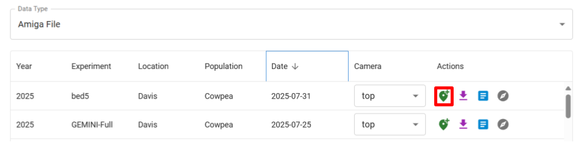
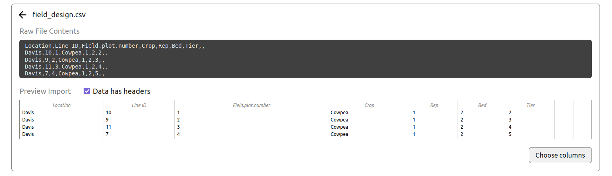
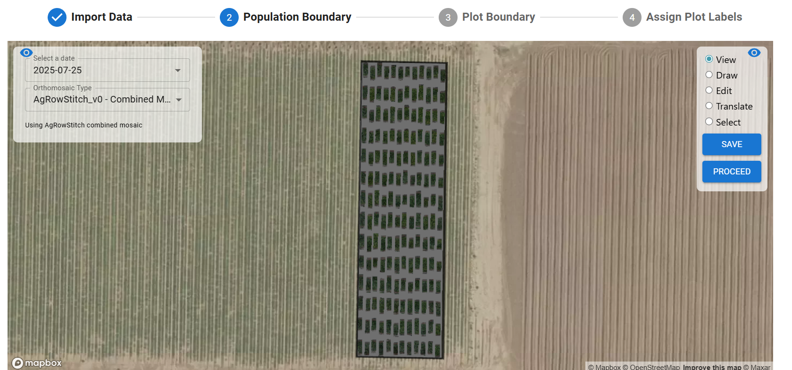
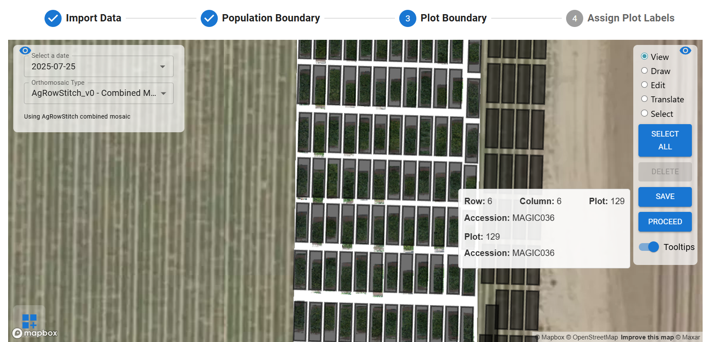
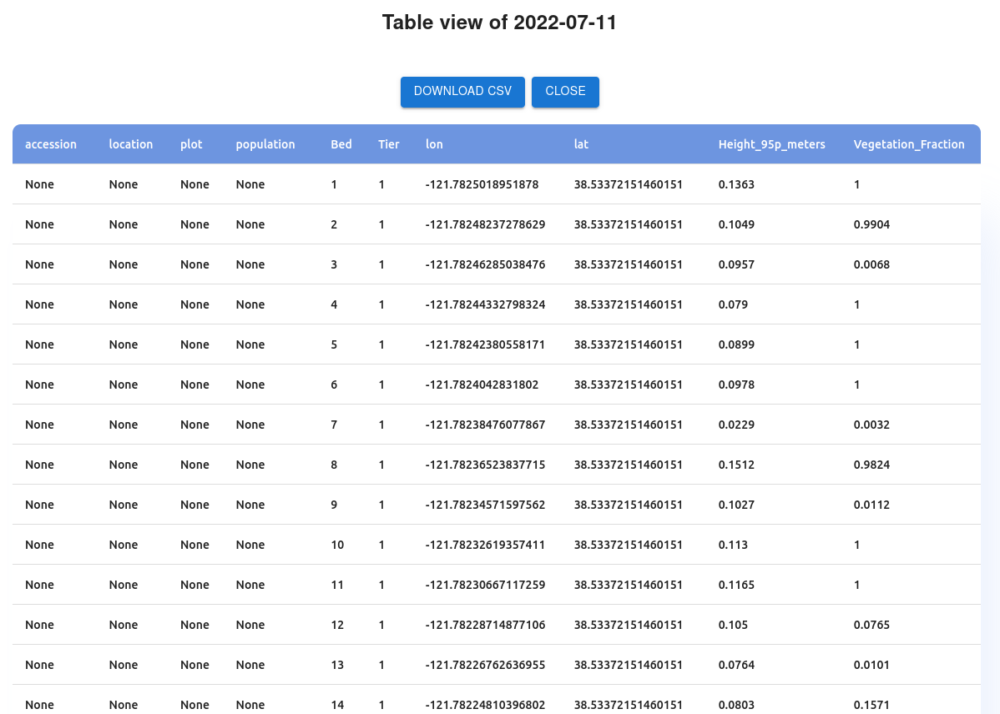
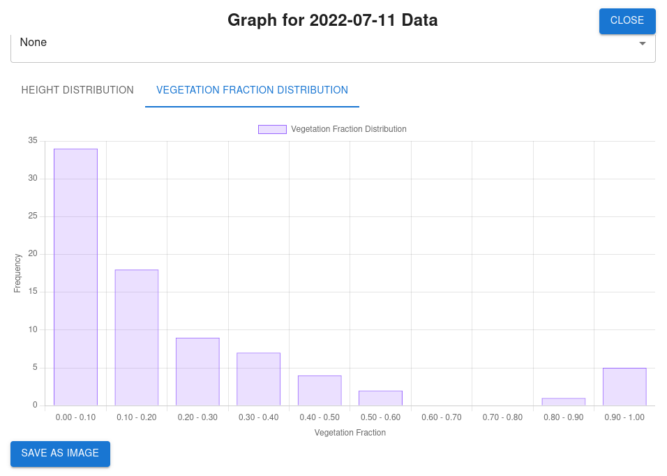

## Upload and Extract Data

To navigate to the File Upload page, click on the `Upload` Icon. In the **Upload Files** section, select `Amiga File` as the data type from the dropdown.

### **Data Fields**

**Year**: This is the year `YYYY` the data was collected. It is a required field. For example, `2022` is a valid year.

**Experiment**: This is open for the user to decide. This will differentiate experiments for a single year. For example, `Experiment 1` is a valid experiment.

**Location**: This is the location where the data was collected. For example, `Davis` is a valid location.

**Population**: This is the type of plants you will be analyzing. For example, `Legumes` is a valid population.

**Date**: This is the date `YYYY-MM-DD` the data was collected. It is a required field. For example, `2022-06-20` is a valid date.
   
### **Uploading Amiga Data**
- Fill in the data fields for the Amiga file(s) you wish to upload. 
- Select the file(s) by dropping files in the dropzone or clicking the dropzone to open a file explorer popup.
- Alternatively, choose `Select Folder` if all binary files you wish to upload are in a single folder.
- The binary files will be uploaded to the app and extracted. Monitor the progress bar in the app to see the upload and extraction progress. For single-file extractions, the extraction progress bar is expected to jump from 0-100 when completed. For multiple files, the bar will update as each file is completed.

## Prepare Data
Navigate to the **Manage Files** tab from the top of the File Upload page. Select `Amiga File` as the data type from the dropdown. 

### **Data Table**

- Navigate to the `Manage Files` tab to view uploaded data and prepare for processing. 
- Hover over any of the action buttons in the `Actions` column to see their function.

### **Plot Marking**

- For processing of Amiga data, plots must be marked in the file management tab before proceeding. 
- Select `Amiga File` from the **Data Type** dropdown. 
- Click the pin icon to open the plot marker.

The plot marker is used to associate images and their GPS coordinates with distinct plots within your field and create stitched images of each plot. Plot marking is performed on an initial date including all plots within the experiment and future dates will be filtered based on these initial plot borders.

- The primary functionality of the plot marker is to mark the start and end of each plot. 
- To begin, navigate to the start of the first plot. Click the start button or press **enter** on your keyboard. 
- Use the arrow keys, WASD, or a mouse to iterate to the end of the plot (Up / Down = Jump Forward 10 Images / Jump Back 10 Images). 
- Align the overlaid midline with the end of the plot and click the stop button (or press enter) to mark the plot end. 
- On your first plot, a popup will appear asking for **Stitch Direction**. This direction is based on the position of the end image with respect to the start.
- If you mistakenly toggle the start button, click the purple **cancel** button to reset.
- Hover over the icons present on the screen for information on the button's functionality.

- **Plot Filtering**: After marking all plots for a given date and associating plot labels / accessions with each, future dates will be filtered based on GPS data to automate the process. 
    - If the filtering does not appear to work, go to the GPS Data panel of the originally marked date. Choose a clear reference point (visible between dates, such as a flag or GCP) and click `Set as GPS Reference`. 
    - Re-open the plot marker of the newly extracted date. Open the GPS Data panel and click `Shift Plots`. After this completes, close and reopen the plot marker to reapply the filtering (filter button is present but not 100% functional as of now).

## Stitch Generation

- Open the process tab to create the stitched plots for your experiment. Populate the fields in the selection panel to select the correct year / location / experiment / population.

### **AgRowStitch**

- In the **Orthomosaic Generation** tab, select `Start` on the date you wish to generate stitches for.
- Under the `Orthomosaic Method` dropdown, select AgRowStitch. This is recommended for ground-based data.
- For now, you can skip the GCP picking process and directly select `Generate Orthophoto`.
- Generation will begin and progress can be tracked via the progress bar at the bottom of the page. 
- After generation is completed, navigate to the **Generated Orthomosaics** tab to view and download the stitched images.

## Plot Boundary Preparation

### **Import Data**

- After stitch generation is finished, the field's plot and accession information is associated with the plot indexes from the plot marker.
- Navigate to the **Plot Boundary Preparation** tab at the top of the screen.
- First, input a field_design.csv file in the requested format:

*Example Field Design*

 

- After uploading, verify that the preview of your data looks correct. If your file has column headers, leave the `Data has headers` box checked. Click `Choose columns`.

- Drag and drop the columns into the appropriate headers used by the app. Navigate through the columns using the left / right arrows. Click `Import` once all required fields are filled. If columns have titles that exactly match those used by the app, the app's field will be filled automatically.

### **Population Boundary**

- After importing data, select the date of the data processing will be done on from the dropdown. Select the version of the stitch you would like to use if multiple exist.
- Choose the `Draw` option on the right of the screen. Click along the outer perimeter of the portion of the orthomosaic you'd like to process. Use the `Edit`, `Translate`, and `Select` options to modify the boundary as needed. When finished, click `Save`.
- Click `Proceed` to continue to the Plot Boundary.

### **Plot Boundary**

- **NOTE**: ALL PLOTS with plot boundaries created must be included in Field Design file even if the plots aren’t being used in the field. Without their inclusion, mapping of accession information will be incorrect.
- Select the stitch once more from the dropdown menu. Click the icon at the bottom left to populate parameters for the plot boundaries.
- Adjust the parameters until you are satisfied with the plot boundaries for trait extraction. 
- Use the options in the top right to modify the placement of individual plot boundaries, or all at once using `Select All`. The `Tooltips` option can be toggled to show plot / accession information on each plot to ensure the boundaries are properly placed.
- **NOTE**: For Amiga data processing, these boundaries do not need to be placed to exactly align with each edge of the stitch. The key is to make sure each boundary is clearly associated with one of the visible stitches (not covering multiple plots). 
- When finished, click `Save`.

### **Assign Plot Labels**

- If an AgRowStitch option is selected, this step should automatically appear.
- After defining the plot boundaries, select the date you have used for plot boundary prep in the dropdown.
- Press `Associate Plots with Boundaries` to save the associations of marked plot indexes with the plot labels and accessions.
- This association will only need to be done once per experiment and associations will be kept for future dates. If a new upload includes additional plots versus the reference date, the plot boundaries can be modified to associate the new plots as needed. 

## Processing

### **Training and Labeling**

- Currently, [Roboflow](https://app.roboflow.com/){:target="_blank"} is recommended for labeling of images and model training.
- Plot images for model training can be downloaded from the **Manage Files** tab in the data table. 
    - If plots have been marked / filtered for the date the download is requested for, only images associated with plots will be downloaded to avoid downloading images that are unlikely to contain useful training data.

### **Predict**

- Run inference on the cloud or locally
  - Cloud inference requires roboflow credits
  - Local inference requires a basic plan or above
- Insert your API Key and Model ID
- Select your Date, Platform, Sensor and Orthomosaic to run inference on
- After inference is completed, results can be viewed per plot with a confidence slider available 
    - Currently only object detection is supported 

## Trait Viewing

To navigate to the statistics page, click on the `Stats` Icon. Use the icon with three lines to open and close the data selection menu.

- The stats page shows processed data in tabular and graphical formats.
- To see statistics from a given date, expand the dropdown menu of the proper platform and sensor type. 
- Click **Load** on the date's table or graph column to view the extracted trait data.

- For the tabular format, you will see a window showing the table of traits. If desired, **Download CSV** can be clicked for the table as a CSV file.

- For the graphical format, you will see a window showing a bar graph representing the number of plots that fell within certain ranges for the currently selected trait.
- To view the graph of a different trait, change the selected trait at the top of the window.
- To view the distribution of a certain accession value (as populated in the uploaded field design file), use the dropdown menu to select a different accession. To view the distribution of all accessions, leave the accession as ***None***.
- To save the current graph view as an image, click **Save As Image** in the bottom left corner.

To navigate to the map page, click on the `Map` Icon. Use the icon with three lines to open and close the data selection menu.

- Populate the data selection menu with the `Year`, `Experiment`, `Location`, `Population`, `Date`, `Platform`, and `Sensor` you wish to view.
- The map will automatically adjust to show the full orthomosaic generated for the parameters selected. 
- Use the dropdown menu to select the `Trait Metric` to view. After selecting, use the next dropdown menu to select the `Genotype` to view.
- The plot boundaries formed in the population boundary step will show a range of colors based on the trait selected. Use the key at the bottom of the map to interpret the colors shown.

## Query

To navigate to the query page, click on the `Query` Icon. Use the icon with three lines to open and close the data selection menu.

- After selecting `Year`, `Experiment`, `Location`, and `Population` in the data selection menu, populate the `Date`, `Platform`, and `Sensor` dropdowns to select the data to query.
- There are three options for image query available, with only one being used at a time:
    - **Plot Numbers**: Select from the dropdown menu the plot numbers whose images are to be queried. 
    - **Accessions**: Select the unique accession IDs of the images to be queried.
    - **Row / Column Pairs**: Input Row / Column pairs (R, C) to select the images to be queried.
- Click `View Images` to see the selected images to the right of the dropdown menus. Click `Download` to download the selected images as a .zip file.
- Images shown on the page can be hovered over to see the unique accession ID and plot number of each.

