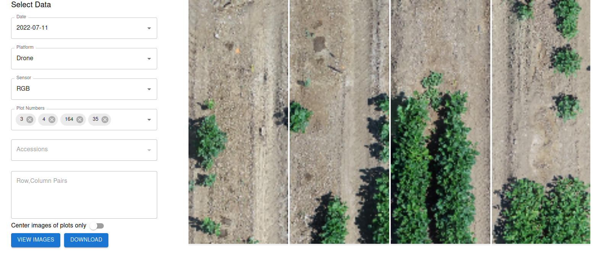

## Upload Data

To navigate to the file upload page, click on the `Upload` Icon.

### Data Types

**Image Data**: This is the raw image files taken from the sensing platforms. These group of images should be coming from an individual sensor. Some image types include: `jpg`, `jpeg`, `png` or `tif`. If your images do not contain EXIF metadata, you will need to upload a separate file called `msgs_synced.csv` under the data type Platform Logs.

**GCP Locations**: This is a `csv` file containing locations of GCPs. The first column should contain the label, the second column contains latitude and the third column contains longitude.

*Example GCP Locations*

**Platform Logs**: 

If you are missing EXIF metadata in your images, you need to upload a separate file and name it `msgs_synced.csv` under this datatype. This file should contain these columns:

- `image_path`: This contains the name of the image (image_0000.jpg). The full path will be built after uploading the final file.
- `time`: Date and time when the image is taken (YYYY:MM:DD HH:MM:SS)
- `lat`: Latitude in decimal degrees
- `lon`: Longitude in decimal degrees
- `alt`: Altitude in meters

*Example msgs_synced.csv file*

You can also upload drone logs into this datatype. You can check the *Drone Operation Manual* section for more information.

### Data Fields

**Year**: This is the year `YYYY` the data was collected. It is a required field. For example, `2022` is a valid year.

**Experiment**: This is open for the user to decide. This will differentiate experiments for a single year. For example, `Experiment 1` is a valid experiment.

**Location**: This is the location where the data was collected. For example, `Davis` is a valid location.

**Population**: This is the type of plants you will be analyzing. For example, `Legumes` is a valid population.

**Date**: This is the date `YYYY-MM-DD` the data was collected. It is a required field. For example, `2022-06-20` is a valid date.

**Platform**: This is the sensing platform used to collect the data. For example, `Drone` is a valid platform.

**Sensor**: This is the data type collected. For example, `RGB` or `Thermal` are valid sensors.

### Upload Files
   
1. Choose the `Data Type` you want to upload.
2. Fill in the respective fields.
3. Drag and drop your files in the upload region.
 
    

### Video Demonstration
[File Upload Video](https://drive.google.com/file/d/1rLYtK0SlU6doJ_DHDvZcZheSWzR7-S1Y/view?usp=sharing){:target="_blank"}

## Manage Files

### Data Table

- Navigate to the `Manage Files` tab to view uploaded data and prepare for processing. 
- Hover over any of the action buttons in the `Actions` column to see their function.

## Orthomosaic Generation

To navigate to the image processing page, click on the `Process` Icon. Use the icon with three lines to open and close the data selection menu.

### OpenDroneMap

- **NOTE**: To maximize orthomosaic output resolution, upload a gcp_locations.csv file in the `Upload` tab.
  - You can also upload the GCP file right after selecting `Start` in the dropdown.
- Under the `Orthomosaic Method` dropdown, select OpenDroneMap. This is recommended for Aerial data with vertical and horizontal overlap.
- After uploading image files to the app, orthomosaic generation can be performed. 
- Expand the dropdown menu of the correct platform and sensor type to select the date to perform generation on. 
- Click the `Start` button to open the orthomosaic generation window. Use the `Previous` and `Next` buttons or the selection bar to iterate through images to mark all visible ground control points (GCPs) if a GCP Locations file was uploaded. If a GCP is placed in error, points can be removed by right-clicking.
- When ready to proceed, click `Generate Orthophoto`. In the settings dropdown, select the orthophoto quality. The `Custom` option can be used with OpenDroneMap args if more specific settings are needed. The default setting attempts to use a GSD (Ground Sampling Distance) of 0.01 cm/pixel. Use the Custom option to input specific GSD values if desired.
- After selecting the quality level, click `Process Images`. 
- Follow the progress of orthomosaic generation by observing the progress bar at the bottom of the page. Progress can also be monitored via the logs, which can be opened using the arrow on the right side of the progress bar.
- Processing may take up to 2 hours with large image datasets. To decrease processing time, use the `Custom` setting with an increased `orthophoto-resolution` flag. For example, the `Custom` setting with `--orthophoto-resolution 1.0` would decrease processing time by a large amount. 
- If any issues are seen with the output orthophoto using the viewer in the `Manage Orthomosaics` window, check the `GEMINI-App-Data/temp/project/code/odm_report/report.pdf` file for more details on the issues / GCP errors encountered during processing. 

## Plot Boundary Preparation

**Import Data**

- After ortho generation is finished, the plot boundary is prepared before further processing.
- First, input a field_design.csv file in the requested format:

*Example Field Design*

 

- After uploading, verify that the preview of your data looks correct. If your file has column headers, leave the `Data has headers` box checked. Click `Choose columns`.

- Drag and drop the columns into the appropriate headers used by the app. Navigate through the columns using the left / right arrows. Click `Import` once all required fields are filled. If columns have titles that exactly match those used by the app, the app's field will be filled automatically.

**Population Boundary**

- After importing data, select the date of the data processing will be done on from the dropdown. Navigate to the location of the orthomosaic in the map.  
- Choose the `Draw` option on the right of the screen. Click along the outer perimeter of the portion of the orthomosaic you'd like to process. Use the `Edit`, `Translate`, and `Select` options to modify the boundary as needed. When finished, click `Save`.
- Click `Proceed` to continue to the Plot Boundary.

**Plot Boundary**

- **NOTE**: ALL PLOTS with plot boundaries created must be included in Field Design file even if the plots aren’t being used in the field. Without their inclusion, mapping of accession information will be incorrect.
- Select the orthomosaic once more from the dropdown menu. Click the icon at the bottom left to populate parameters for the plot boundaries.
- Adjust the parameters until you are satisfied with the plot boundaries for trait extraction. 
- Use the options in the top right to modify the placement of individual rectangles, or all at once using `Select All`. 
- When finished, click `Save`.

## Trait Extraction

- After preparing the plot boundary, aerial traits can be processed.
- To process traits, click `Start` on the appropriate date's traits column. Click `Analyze` to begin processing.
- If traits need to be processed more than once, click on the blue checkbox and click `Analyze` again.
- In the future, the **Teach Traits** tab will allow for use of trainable aerial models.

## Trait Viewing

To navigate to the statistics page, click on the `Stats` Icon. Use the icon with three lines to open and close the data selection menu.

- The stats page shows processed data in tabular and graphical formats.
- To see statistics from a given date, expand the dropdown menu of the proper platform and sensor type. 
- Click **Load** on the date's table or graph column to view the extracted trait data.

- For the tabular format, you will see a window showing the table of traits. If desired, **Download CSV** can be clicked for the table as a CSV file.

- For the graphical format, you will see a window showing a bar graph representing the number of plots that fell within certain ranges for the currently selected trait.
- To view the graph of a different trait, change the selected trait at the top of the window.
- To view the distribution of a certain accession value (as populated in the uploaded field design file), use the dropdown menu to select a different accession. To view the distribution of all accessions, leave the accession as ***None***.
- To save the current graph view as an image, click **Save As Image** in the bottom left corner.

To navigate to the map page, click on the `Map` Icon. Use the icon with three lines to open and close the data selection menu.

- Populate the data selection menu with the `Year`, `Experiment`, `Location`, `Population`, `Date`, `Platform`, and `Sensor` you wish to view.
- The map will automatically adjust to show the full orthomosaic generated for the parameters selected. 
- Use the dropdown menu to select the `Trait Metric` to view. After selecting, use the next dropdown menu to select the `Genotype` to view.
- The rectangles formed in the population boundary step will show a range of colors based on the trait selected. Use the key at the bottom of the map to interpret the colors shown.

## Query

To navigate to the query page, click on the `Query` Icon. Use the icon with three lines to open and close the data selection menu.

- After selecting `Year`, `Experiment`, `Location`, and `Population` in the data selection menu, populate the `Date`, `Platform`, and `Sensor` dropdowns to select the data to query.
- There are three options for image query available, with only one being used at a time:
    - **Plot Numbers**: Select from the dropdown menu the plot numbers whose images are to be queried. 
    - **Accessions**: Select the unique accession IDs of the images to be queried.
    - **Row / Column Pairs**: Input Row / Column pairs (R, C) to select the images to be queried.
- Click `View Images` to see the selected images to the right of the dropdown menus. Click `Download` to download the selected images as a .zip file.
- Images shown on the page can be hovered over to see the unique accession ID and plot number of each.

