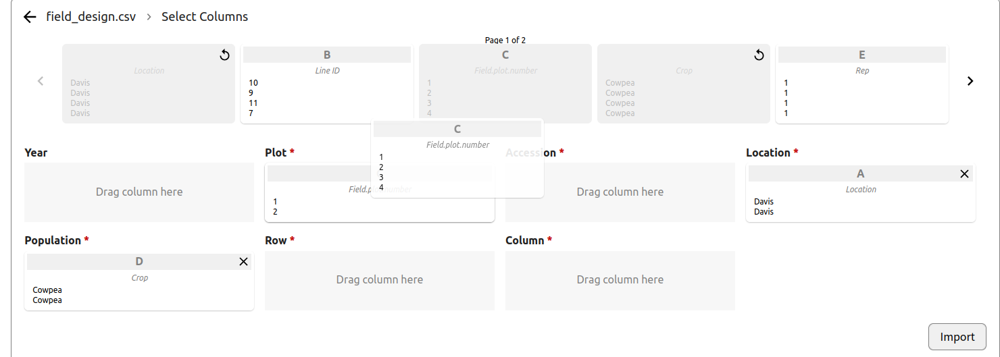
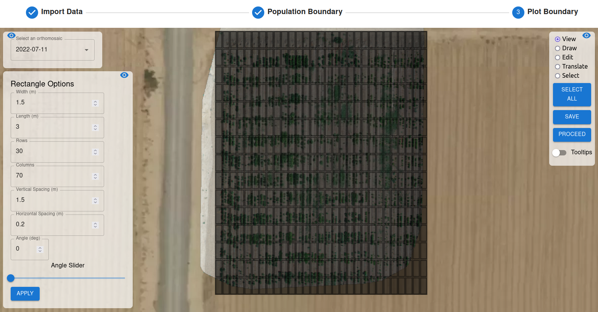

To navigate to the image processing page, click on the `Process` Icon. Use the icon with three lines to open and close the data selection menu.

## Orthomosaic Generation

- **NOTE**: To maximize orthomosaic output resolution, upload a gcp_locations.csv file in the `Upload` tab.
- After uploading image files to the app, orthomosaic generation can be performed. 
- Expand the dropdown menu of the correct platform and sensor type to select the date to perform generation on. 
- Click the `Start` button to open the orthomosaic generation window. Use the `Previous` and `Next` buttons or the selection bar to iterate through images to mark all visible ground control points (GCPs) if a GCP Locations file was uploaded. If a GCP is placed in error, points can be removed by right-clicking.
- When ready to proceed, click `Generate Orthophoto`. In the settings dropdown, select the orthophoto quality. The `Custom` option can be used with OpenDroneMap args if more specific settings are needed. The default setting attempts to use a GSD (Ground Sampling Distance) of 0.01 cm/pixel. Use the Custom option to input specific GSD values if desired.
- After selecting the quality level, click `Process Images`. 
- Follow the progress of orthomosaic generation by observing the progress bar at the bottom of the page. Progress can also be monitored via the logs, which can be opened using the arrow on the right side of the progress bar.
- Processing may take up to 2 hours with large image datasets. To decrease processing time, use the `Custom` setting with an increased `orthophoto-resolution` flag. For example, the `Custom` setting with `--orthophoto-resolution 1.0` would decrease processing time by a large amount. 
- If any issues are seen with the output orthophoto using the viewer in the `Manage Orthomosaics` window, check the `GEMINI-App-Data/temp/project/code/odm_report/report.pdf` file for more details on the issues / GCP errors encountered during processing. 

## Plot Boundary Preparation

**Import Data**

- After ortho generation is finished, the plot boundary is prepared before further processing.
- First, input a field_design.csv file in the requested format:

*Example Field Design*

 

- After uploading, verify that the preview of your data looks correct. If your file has column headers, leave the `Data has headers` box checked. Click `Choose columns`.

- Drag and drop the columns into the appropriate headers used by the app. Navigate through the columns using the left / right arrows. Click `Import` once all required fields are filled. If columns have titles that exactly match those used by the app, the app's field will be filled automatically.

**Population Boundary**

- After importing data, select the date of the data processing will be done on from the dropdown. Navigate to the location of the orthomosaic in the map.  
- Choose the `Draw` option on the right of the screen. Click along the outer perimeter of the portion of the orthomosaic you'd like to process. Use the `Edit`, `Translate`, and `Select` options to modify the boundary as needed. When finished, click `Save`.
- Click `Proceed` to continue to the Plot Boundary.

**Plot Boundary**

- **NOTE**: ALL PLOTS with plot boundaries created must be included in Field Design file even if the plots aren’t being used in the field. Without their inclusion, mapping of accession information will be incorrect.
- Select the orthomosaic once more from the dropdown menu. Click the icon at the bottom left to populate parameters for the plot boundaries.
- Adjust the parameters until you are satisfied with the plot boundaries for trait extraction. 
- Use the options in the top right to modify the placement of individual rectangles, or all at once using `Select All`. 
- When finished, click `Save`.

## Aerial Processing

- After preparing the plot boundary, aerial traits can be processed.
- To process traits, click `Start` on the appropriate date's traits column. Click `Analyze` to begin processing.
- If traits need to be processed more than once, click on the blue checkbox and click `Analyze` again.
- In the future, the **Teach Traits** tab will allow for use of trainable aerial models.

## Ground Processing

**Locate Plants**

- This functionality locates each plant for a given population. Each of these tasks must be done sequentially:
    - ***Labels***: Upload labels of plants using CVAT for a given date. To open CVAT, click the Annotate button. After annotating in CVAT, export your label in YOLO format, and then upload your .txt label files here. Press Upload when finished.
    - ***Model***: Train a deep learning model for individual plant detection. Each model trained can be tracked using its Model ID. Best performing models are recommended to use for Locations.
    - ***Locations***: Locate each plant in a population for a given date. The user inputs their model of choice to run this function. Best performing models are recommended to use for Locations. 

**Label Traits**

- This section allows users to upload their annotations for each trait. To open CVAT, click the Annotate button. After annotating in CVAT, export your label in YOLO format, and then upload your .txt label files here. Press Upload when finished.

**Teach Traits**

- This section train models to detect the selected trait. First, select a trait to teach. Then, input the platform, sensor and date of choice to train the model.

**Extract Traits**

- This section allows users to extract the selected trait for a given population and date. First, select a trait to teach. Then, input the platform, sensor and date of choice to extract the specified trait. It is recommended to use the highest performing model and locations.
