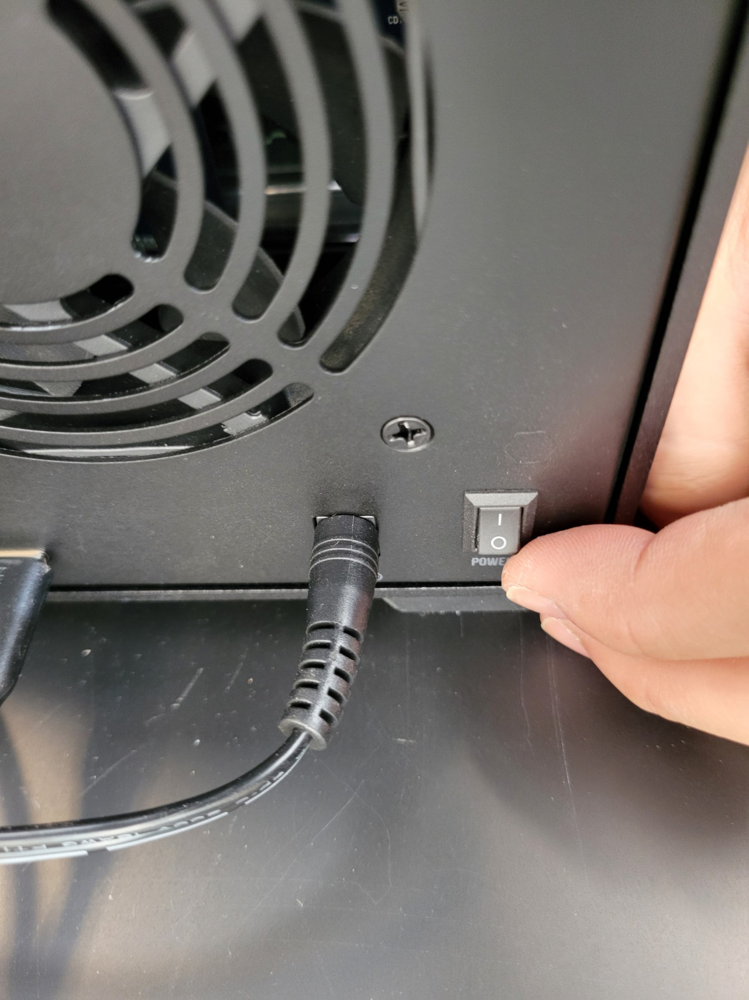
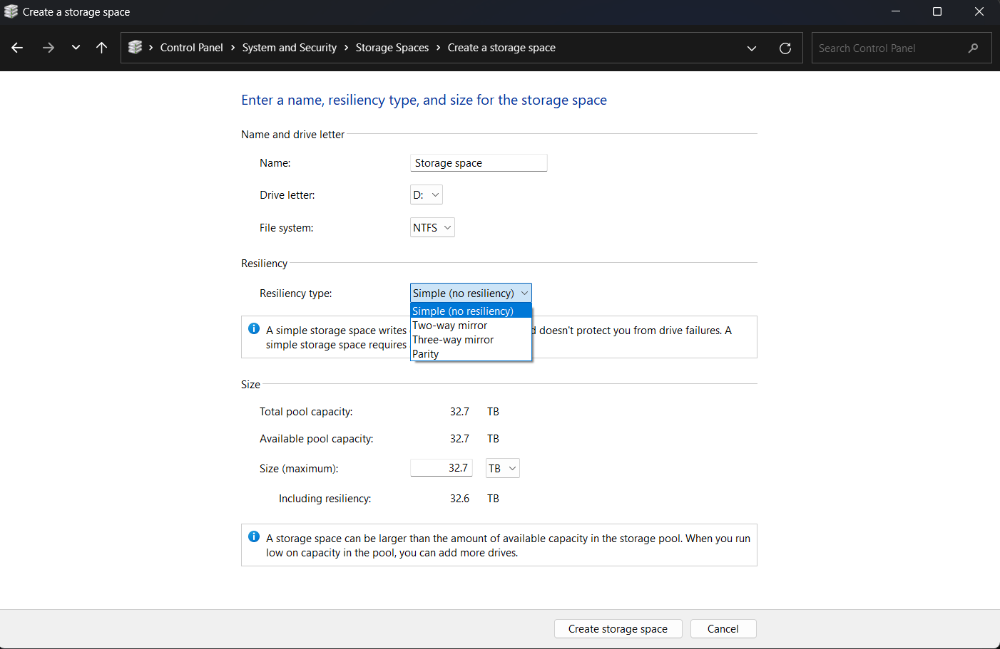
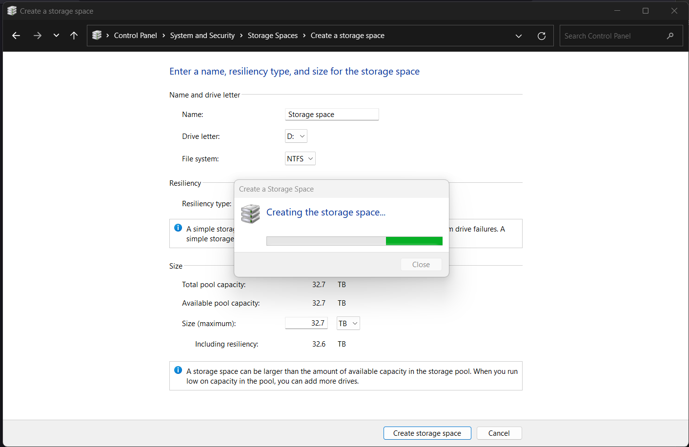
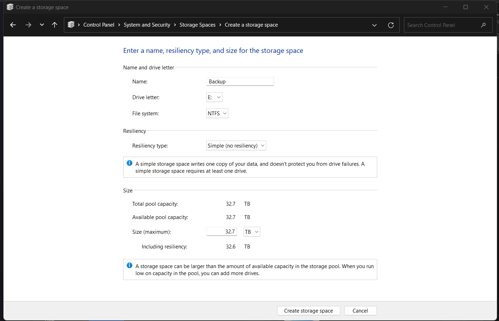
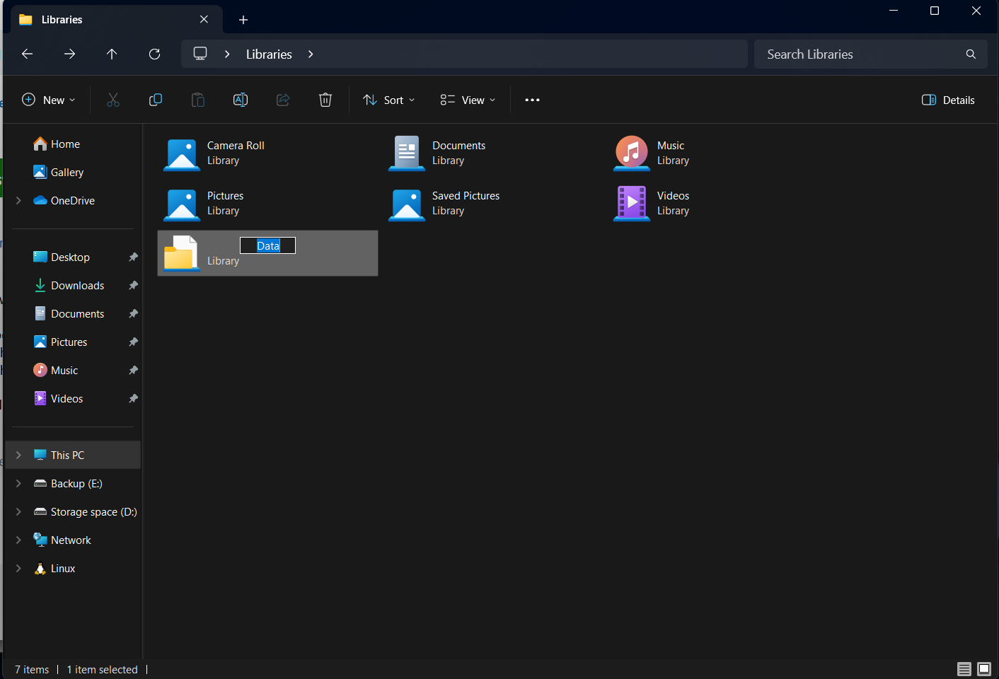
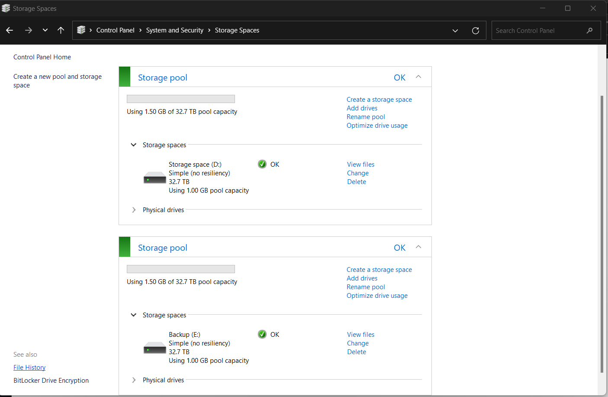

## Preparation
Laptop, Sabrant DAS, 4 HDDs

Open the hard disk slots and insert all the hard disks.

Turn on the power.

Turn on only the top two for the initial storage pool setup.

## Data Storage Pool Setup

Set as a Simple type

Next, set the backup disk pool setup

**Add Data Disk (D:) to Library**

Click (+) New on upper left

Add D: Drive to the added library

**Turn on File History**

Use E: Drive as File History Disk

**To Test, Copy the file into the D:**

And click run now

