## Preparation
Laptop, Sabrant DAS, 4 HDDs

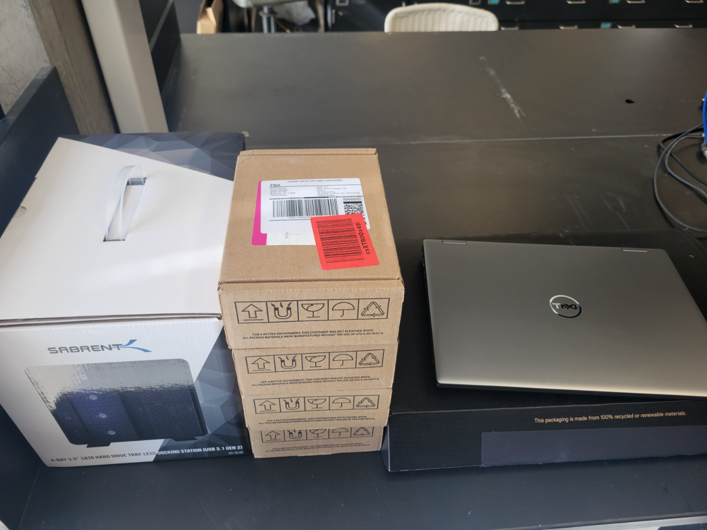

Open the hard disk slots and insert all the hard disks.

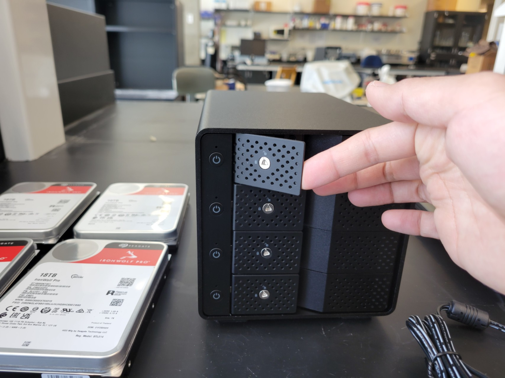

Turn on the power.

Turn on only the top two for initial storage pool setup.

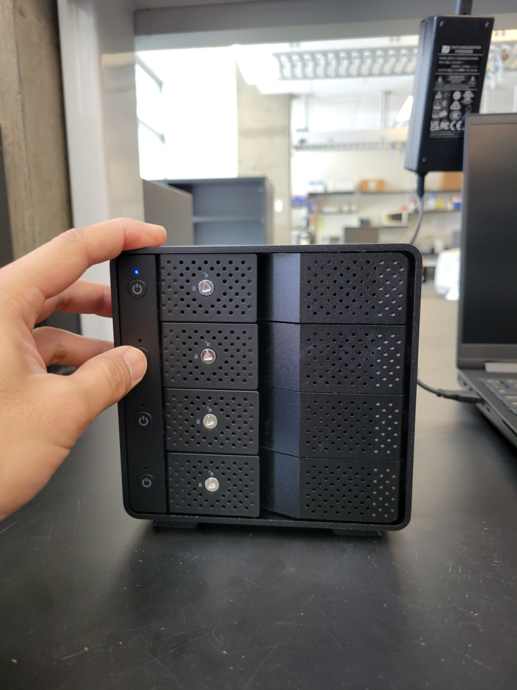

## Data Storage Pool Setup

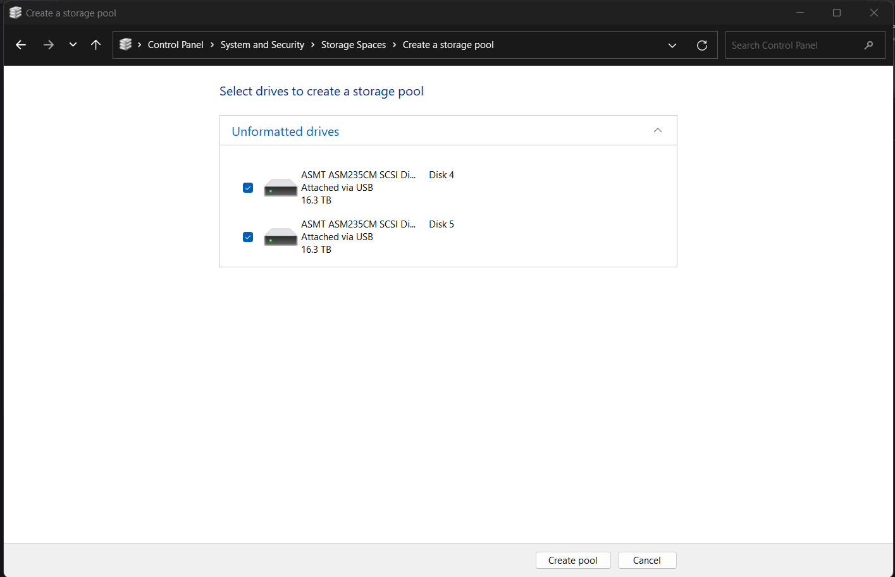

Set as Simple type

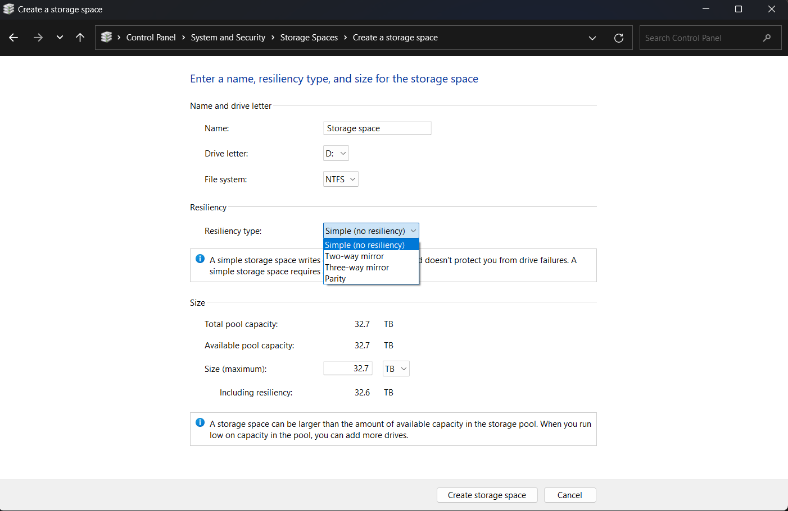

Next, backup disk pool setup

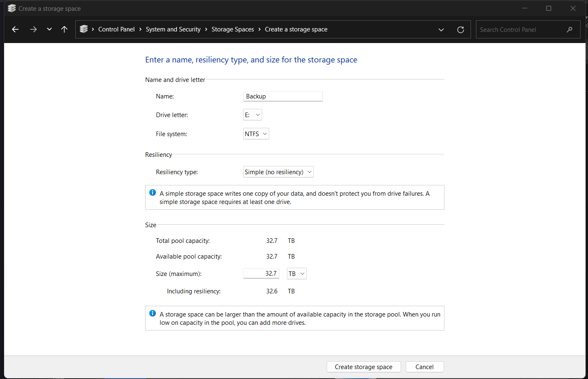

**Add Data Disk (D:) to Library**

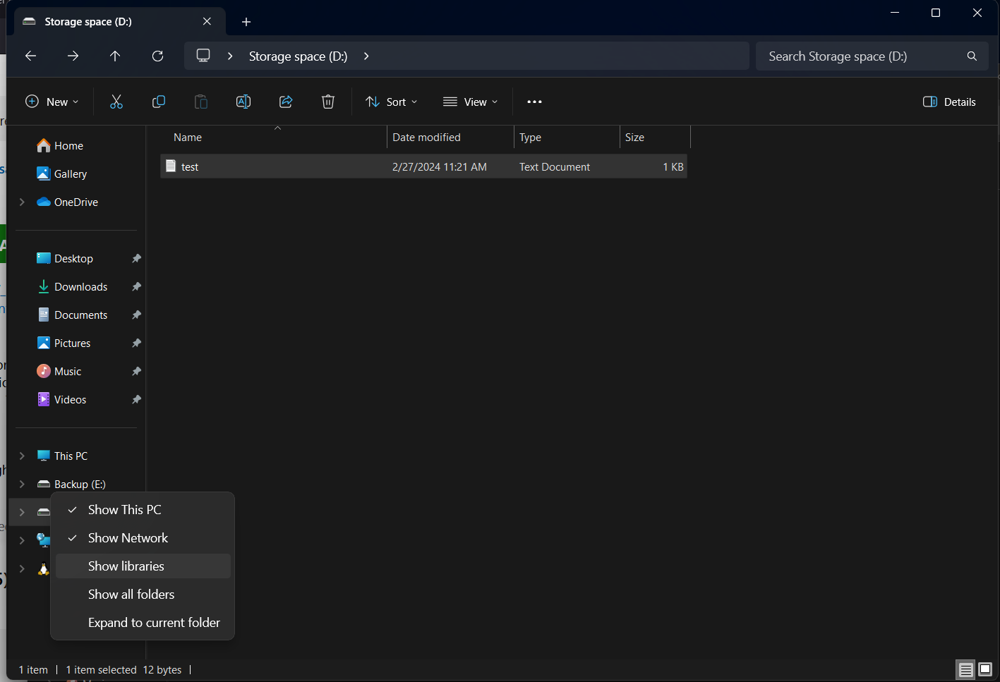

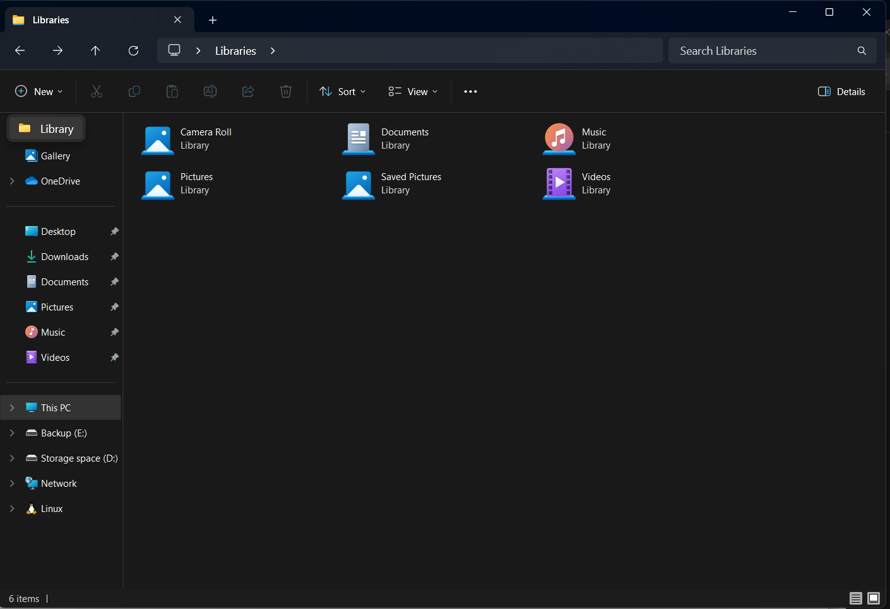

Click (+) New on upper left

Add D: Drive to the added library

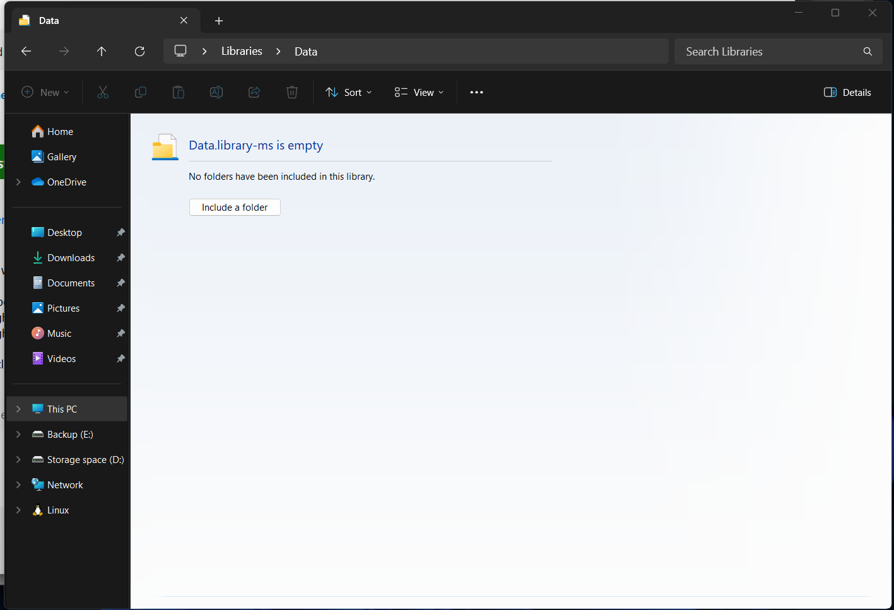

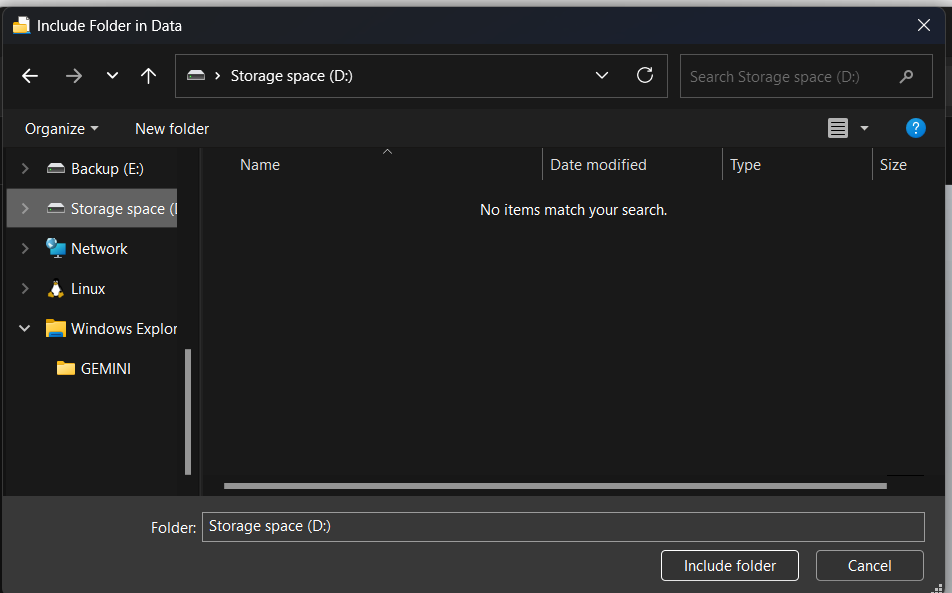

**Turn on File History**

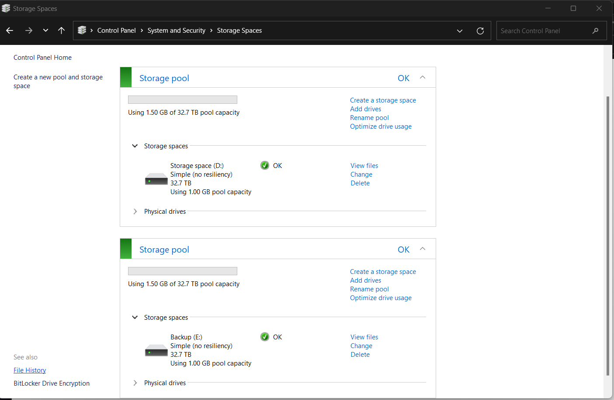

Use E: Drive as File History Disk

**To Test, Copy the file into the D:**

And click run now

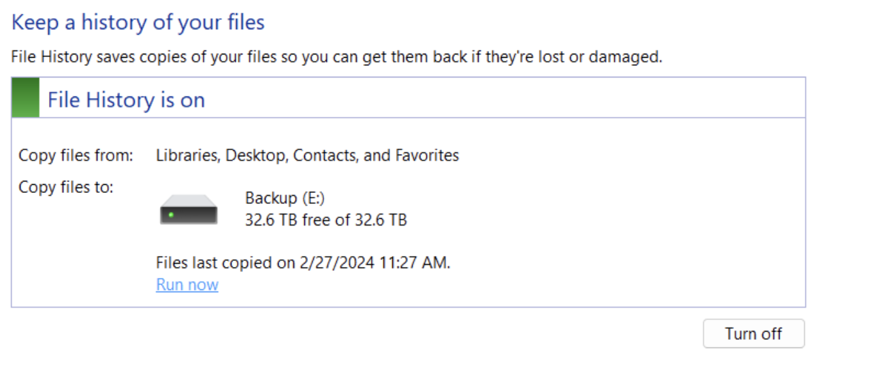