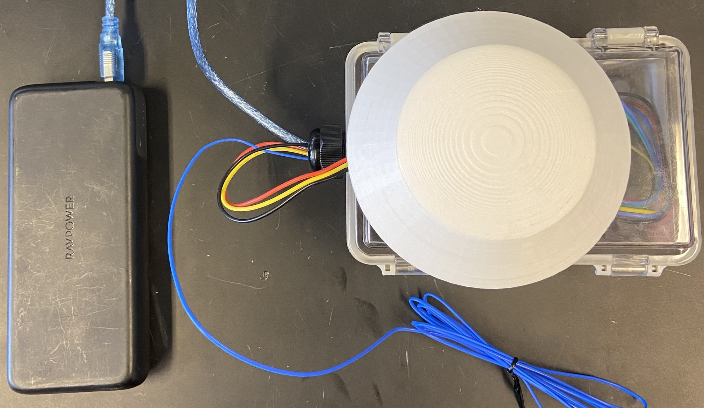

## **Build Guide**

### Component List
- **Arduino Uno R3 (or equivalent)**: [Documentation](https://docs.arduino.cc/hardware/uno-rev3/){:target="_blank"}
- **Datalogger Shield**: [Documentation](https://learn.adafruit.com/adafruit-data-logger-shield/overview){:target="_blank"}
- **DHT22 Temperature / Humidity Sensor**: [Documentation](https://www.sparkfun.com/datasheets/Sensors/Temperature/DHT22.pdf){:target="_blank"}
- **HM-10 Bluetooth Module**: [Documentation](https://people.ece.cornell.edu/land/courses/ece4760/PIC32/uart/HM10/DSD%20TECH%20HM-10%20datasheet.pdf){:target="_blank"} / [Link](https://www.deshide.com/product-details.html?pid=344835&_t=1665209850){:target="_blank"}
- **MAX6675 Thermocouple-to-Digital Converter**: [Documentation](https://www.analog.com/media/en/technical-documentation/data-sheets/max6675.pdf){:target="_blank"}
- **Enclosure**: [Link](https://www.amazon.com/Laisomeke-Waterproof-Junction-Enclosure-Electrical/dp/B0BR5DY1VG?th=1){:target="_blank"}
- SD Card for storing collected data
- Basic soldering and crimping equipment
- Double-sided tape to attach components to enclosure

### Build Instructions

**Setup:**

- Bore a hole in the side of the enclosure to size for a cable gland. Drill the hole as low as possible on the side to allow the Arduino USB cable to be inserted with a minimal bend. Insert a cable gland into the hole. 
- Secure the Arduino and the bluetooth module in the bottom of the enclosure. Secure the thermocouple module (with wire connected) to the inside side of the box opposite the hinge with its pins facing away from the cable gland.  
- Attach the temperature / humidity sensor to the top of the enclosure if using a radiation shield. If not, attach the sensor on the side of the enclosure.  
- See [bottom of page](#completed-weather-station) for the internals of a completed weather station and clarification on placement of components.

**Arduino Wiring Guide:**   

### Soldering Guide
- Use the example soldered datalogger board (shown [below](#example-soldered-board)) for reference throughout the soldering process.
- On three distinct, well-spaced rows of the prototyping area of the datalogger, solder 5-pin, 6-pin, and 3-pin male [JST-XH headers](https://www.amazon.com/GeeBat-460pcs-Connector-Housing-Adapter/dp/B01MCZE2HM){:target="_blank"}. Leave the bottom two rows of the prototyping area untouched. The image below uses rows R1, R5, and R9, leaving R11 free for later. See underside soldering [here](imgs/wsSolderGuide1.jpg){:target="_blank"}.

- Solder a wire from the 5V source to R11 for easier access to the source later on. Solder a wire from the board GND to another point on R11. For convenience, the 5V and GND can also be soldered to the 3-pin header at this time (as [shown](imgs/wsSolderGuide2.jpeg){:target="_blank"}).
- **NOTE: All pins referred to for soldering on the board reference the digital pins on the right side, not the analog inputs on the left.**  

- ***5-pin header***: Connect the first (leftmost) pin to P13. Connect the next pin to P4. Connect the third pin to P12. Connect the fourth pin to the 5V source. Connect the final pin to GND. See soldered board after this step [here](imgs/wsSolderGuide3.jpeg){:target="_blank"}.
- ***6-pin header***: The outer pin on either side will be unused. Connect the second pin (leftmost pin in use) to P6. Connect the third pin to P5. Connect the fourth pin to GND. Connect the fifth pin (rightmost pin in use) to the 3.3V source. See soldered board after this step [here](imgs/wsSolderGuide4.jpeg){:target="_blank"}.
- ***3-pin header***: Connect the first (leftmost) pin to the 5V source and the last (rightmost) pin to GND if these were not already connected. Connect the second pin to P2.  
### Example Soldered Board
- The final soldered board should look similar to this:

### Assembly
- With three distinctly colored wires (sized appropriately to reach the temperature / humidity sensor from the board), use female JST-XH crimp terminals and a crimp tool to crimp the ends of each wire. Connect the ends of each wire to 3-pin female JST-XH Headers. Repeat this process for five wires to length for the thermocouple module.  
- When connecting the crimped wires to the female headers, pay close attention to how the header will connect with the previously soldered male headers. 
- Using **four** distinctly colored wires (sized to reach the bluetooth module), connect the ends of each wire to the **middle four** pins of **6-pin** female JST-XH headers.  
- Connect the female wire headers to the properly sized male headers on the board. The 6-pin connector should be connected to the bluetooth module, with the 5-pin and 3-pin connectors going to the thermocouple module and through the cable gland to the temperature / humidity sensor respectively. See wires correctly connected to the female headers and board [here](imgs/dataloggerWires.jpeg){:target="_blank"}.
- To ensure that the wires are connected properly, one can match the pin connected to the voltage source with the VCC or GND pin on the respective component. Pay attention to which wire is connected to each pin. 
- Connect the Arduino USB cable through the enclosure. If the cable gland included in the linked enclosure is used, some material will have to be shaved from the corners of the USB-B end of the cable.  
- Attach the thermocouple wire to the module's input. Depending on the style of thermocouple used, it may be necessary to solder the thermocouple to the module. 
- Attach the datalogger (with a CR1220 battery and SD Card in place) to the Arduino.  
- If using a radiation shield, attach the radiation shield to the top of the box, covering the temperature / humidity sensor.
### Completed Weather Station
**Internals:**

**Station with Radiation Shield:**

## **Usage**
  
### Uploading RH_Temp_Logger
- The file [RH_Temp_Logger.ino](https://github.com/GEMINI-Breeding/weather-station/blob/main/RH_Temp_Logger/RH_Temp_Logger.ino){:target="_blank"} is used to operate the weather station and must be uploaded to the Arduino before use.
- Install the [Arduino IDE](https://www.arduino.cc/en/software){:target="_blank"} software and open RH_Temp_Logger.ino in the IDE.  
- In the built-in library manager, search for and install: **SD**, **RTClib**, **DHT sensor library**, **MAX6675 library**, and **MAX6675 with hardware SPI**.  
- Connect the Arduino's USB cable to the computer and select the correct board / port in the IDE.
- Click "Upload" (Ctrl+U) to upload the sketch to the Arduino. The station is now ready for use with the GEMINI sensing app.
- To verify everything is working properly, the serial monitor in the Arduino IDE can be used.

**Expected Output**

### General Usage
- Connect the USB cable from the Arduino to a 5V power supply.  
- To update the weather station's RTC clock (GMT-0 time zone), turn on the GEMINI app prior to powering the weather station. 
- Depending on your use case, you may either place the weather station in the field to take measurements or attach the unit to the rover.   

- Data from the weather station is stored in the SD Card on the datalogger. The data is logged in a CSV format in a file titled YYYYMMDD.CSV based on the current date. 

