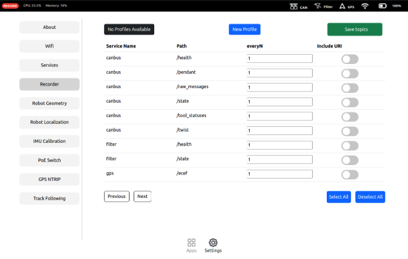
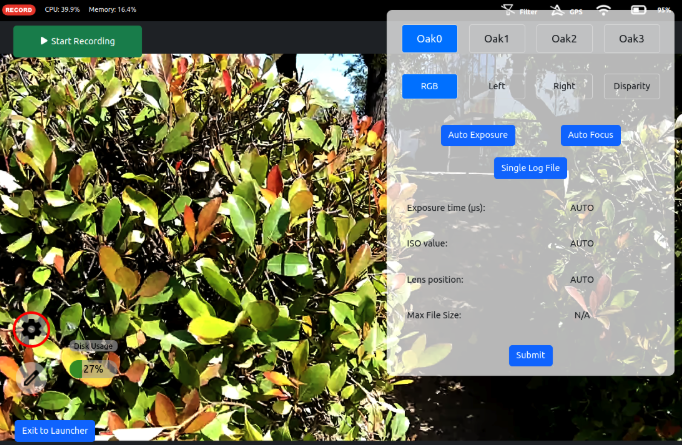
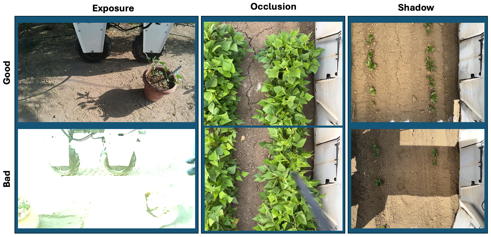
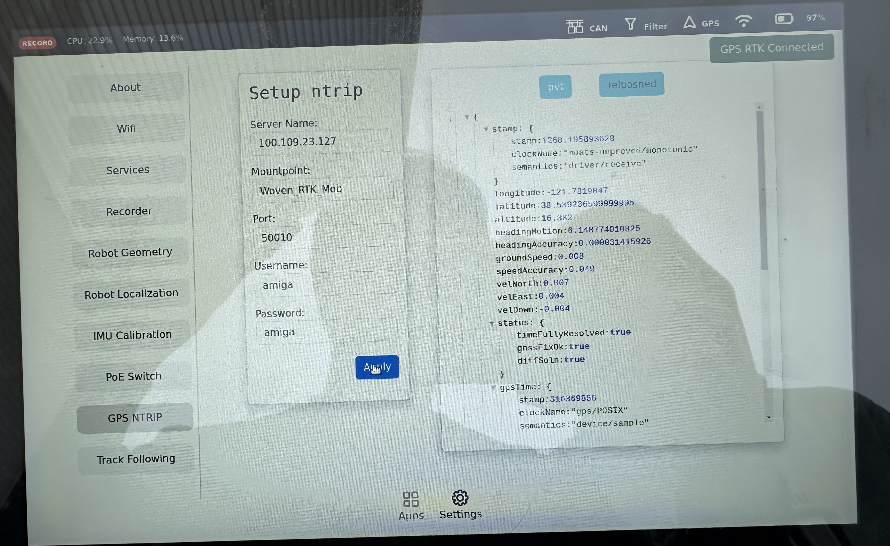
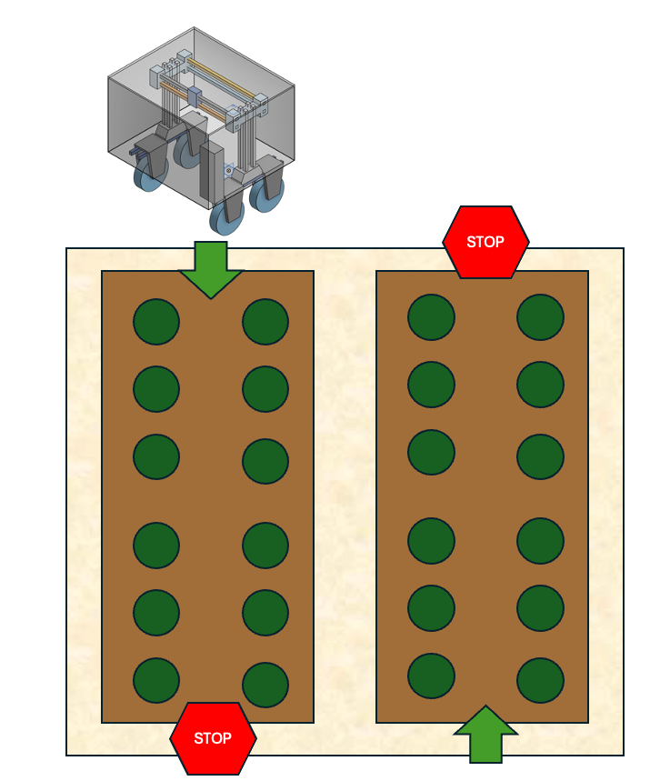

## **Pre-Data Collection**

### Select Topics
- Before recording, ensure that the following topics are being recorded by going into your settings and going to the *Recorder* tab.
  - To include the topics, press the *Include URI* button next to the topic name.

- The following topics should be selected for recording (create a profile if needed):

| GPS Topics      | Oak0 Topics        | Oak1 Topics        | Oak2 Topics        |
|-----------------|--------------------|--------------------|--------------------|
| /gps/ecef       | oak/0/calibration   | oak/1/calibration   | oak/2/calibration   |
| /gps/pvt        | oak/0/disparity     | oak/1/disparity     | oak/2/disparity     |
| /gps/relposned  | oak/0/imu           | oak/1/imu           | oak/2/imu           |
|                 | oak/0/rgb           | oak/1/rgb           | oak/2/rgb           |

### **Image Quality Assurance**

- Take a sample recording while driving the Amiga to the field (at the speed you hope to drive the Amiga through the field). 
- View the recording in the file manager app to observe any issues with blur, exposure, occlusion, shadows, or camera position / perspective. 
    - Use the dropdown in the top left to toggle which Oak camera's recording is shown.
- Before beginning recording for the day, use the settings icon in the Camera App to show each camera's output on the display. 
    - Use the *Auto Exposure* and *Auto Focus* buttons to recalibrate each camera if there appears to be an issue.
- Once you have verified that the image quality looks correct, recording can begin once the GPS RTK connection has been made. 

### **GPS Quality Assurance**

- Connect GPS Base Station to WiFi and ensure that the attena is connected to the base station.
  - It is recommended that the attena is placed outside with a clear view of the sky.
- Connect the Amiga to WiFi as well and go to the settings *GPS NTRIP* tab.
  - NOTE: The Amiga and Base Station DO NOT need to be on the same WiFi network, but they do need to be connected to the internet.
- Ensure that a green notification appears in the top right corner of the screen indicating that the GPS is connected to the base station.

## **Data Collection**

- Please go through the Pre-Data Collection steps before proceding.
- We assume your field experiment is split into columns and rows. 
- Drive your Amiga to the start of the first column and press the *Record* button in the Camera Recorder App.
  - The Amiga will begin recording the camera data and GPS data.
  - At the end of the first column, press the *Stop* button in the Camera Recorder App.
- If you have different experiments in the same column, you may stop recording at any point and start a new recording.
  - However, it is difficult to track recordings if you stop and start recording multiple times in the same column.

