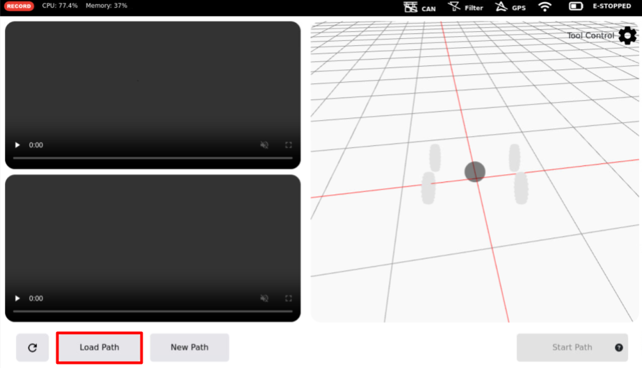

## Autoplot Prerequisites
- Open the `Settings` tab from the Brain home screen.

### IMU Calibration
- If you have not calibrated the rover IMU or have made recent changes to the rover, use the `IMU Calibration` settings pane to calibrate.
- With the rover on flat ground, click `Start Calibration` to begin.
- You will see a popup to remind you to move the rover to flat ground. Click `Confirm` to continue. Calibration should complete within a few seconds.

### Robot Geometry
- The autoplot app requires accurate robot geometry information to be entered in the brain.
- Measure the wheelbase and track width using a tape measure.
- Find the center point of the amiga using these measurements.
- Measure the placement of the top camera (OAK0) for IMU Offset and the GPS antenna for GPS Offset relative to this center point.
- The x and y offset definitions can be seen in the image below (via farm-ng). Facing the direction of the dashboard, negative y values are defined as right of the center point while negative x values are defined as behind the center point.  

- Once the offsets have been found, update the values in the `Robot Geometry` pane of the settings tab.
- Click `Apply` to save the robot geometry and proceed.

### GPS NTRIP / WiFi
- Ensure base station credentials are populated in the `GPS NTRIP` settings pane.
- When GPS is properly connected, the GPS symbol will not be crossed out and the `GPS RTK CONNECTED` message will be present on the `GPS NTRIP` tab, as seen [here](2- Recording.md/#gps-quality-assurance).
- Make sure the amiga is connected to WiFi.

### Path Creation
- After satisfying the prerequisites, open the `Autoplot` app from the amiga Brain. 
- After some load time, two camera streams will be visible on the left side of the screen.
- To create a new path, click the `New Path` button. Begin driving the amiga along the path using the pendant. 

- When you've reached the end of the desired path, click `Save Path` and give the recorded path a name. If you deviate from the desired path, you can click `Pause` and `Remove Point` to fix the path before resuming recording.

### Path Following
- To follow a path, click the `Load Path` button to see the saved path recordings. Select the path you'd like to load.

- Now, the dashboard has to be set to auto-control mode to start the path.
- On the dashboard, click the `A` symbol to open the auto control tab.

- In the auto control tab, press the `AUTO CONTROL` button to turn auto control on.

- Once auto control has been turned on and all other prerequisites have been met, the status indicators on the amiga Brain should be as shown:

- If there are no issues, the `Start Path` button can now be clicked in the Autoplot app. Path following will work best if you `Start Path` with the amiga close to the starting point facing the same direction as when the recording was started.

### Debugging
- If any prerequisite service on the status bar is crossed out, click the icon for more information. 
- If the `Start Path` button is still shows a question mark, press the button for information on the error. 
- Errors related to GPS accuracy can be avoided by adjusting the thresholds in the `Robot Localization` settings pane.
- Guidelines on adjustment of the distance and time thresholds are provided within the settings pane. We recommend increasing the `Path Deviation Threshold` and `Minimum GPS Accuracy` values to avoid errors. The exact values to increase to should be determined by in-field testing and may vary based on distance from RTK base station.