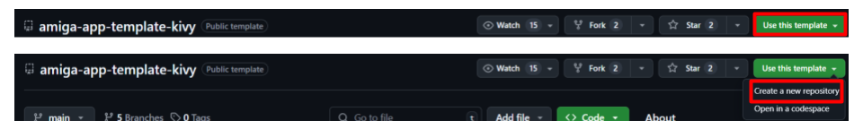
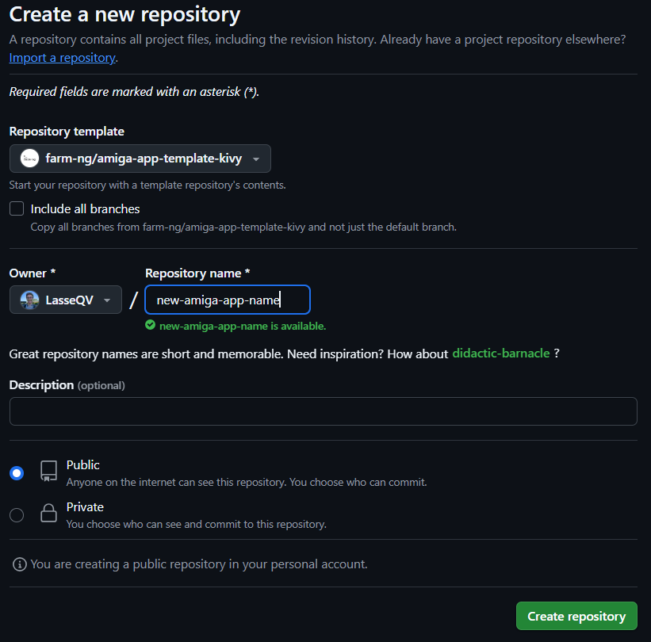
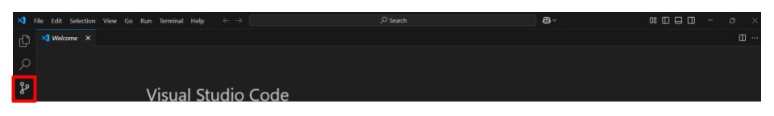

## **Prerequisites**

### Device Access
- The amiga brain must be connected to WiFi for any on-device app development.
- Follow the farm-ng documentation on [requesting device SSH access and configuring SSH keys.](https://amiga.farm-ng.com/docs/ssh/){:target="_blank"} 
- Follow the [Tailscale quickstart guide](https://tailscale.com/kb/1017/install){:target="_blank"}  using the same Google account used in your farm-ng fleet manager login for your tailnet login. 
- Add the device you intend to develop from to your tailnet. Marcelo will share the link to add your amiga to your tailnet.

## **Development Environment**

### VSCode
- [VSCode](https://code.visualstudio.com/download){:target="_blank:} is recommended for app development on the amiga.
- With Tailscale active on your device (using `sudo tailscale up` on Linux or opening the app on Windows or Mac), find the amiga's IP-address.
- Follow the instructions from farm-ng for [configuration of SSH connections using VSCode.](https://amiga.farm-ng.com/docs/ssh/#recommended-configure-your-ssh-connections){:target="_blank"} 

### UI Testing
- To develop apps without physical access to the brain, a method to view the UI is needed.
- After configuring and opening Tailscale, type the brain IP address into a browser. 
- After some load time, the brain UI should be visible in the browser. 

## **App Development**

### farm-ng App Templates
- farm-ng provides app templates that can be used to simplify app development together with app examples.
- Depending on your preference, you can use the [ReactJS farm-ng app guide](https://amiga.farm-ng.com/docs/brain/brain-apps){:target="_blank"} or [Kivy farm-ng app guide](https://amiga.farm-ng.com/docs/brain/brain-apps-kivy){:target="_blank"} to start developing.
- Using Github, create a new personal repository from the desired app template: [Kivy Template](https://github.com/farm-ng/amiga-app-template-kivy){:target="_blank"} / [ReactJS Template](https://github.com/farm-ng/amiga-app-template){:target="_blank"} 

- After clicking `Create a new repository`, name your new app repository and add a description as desired. Choose whether the repository should be public or private. Click `Create repository` when finished.

### Cloning the New App
- The new app now needs to be cloned to the amiga brain for development. 
- Open a new VSCode window. Open the source control tab from the left sidebar.

- Click `Clone repository`. Next, either choose `Clone from Github` or paste in the repository URL from the repository's `Code` button.
- If you have not previously set up Git credentials for cloning repositories, follow the [Github docs on remote repositories and cloning methods](https://docs.github.com/en/get-started/git-basics/about-remote-repositories){:target="_blank"}.

### Running the App
- After cloning the repository and developing the app using the examples and information shown in the [ReactJS farm-ng app guide](https://amiga.farm-ng.com/docs/brain/brain-apps){:target="_blank"} or [Kivy farm-ng app guide](https://amiga.farm-ng.com/docs/brain/brain-apps-kivy){:target="_blank"}, the app can be tested.
- For apps using the UI, go to the amiga IP address in a browser to see and interact with the brain.
- In the VSCode terminal, locate the `entry.sh` script to be used to open the app.
- Make the script executable by entering `sudo chmod +x entry.sh` in the terminal.
- Run `./entry.sh`. The app or any error starting the app should be seen on the UI. Logging information on the app start will be shown in the terminal.
- Make sure to change the path saved in the `exec_cmd` field to the correct `entry.sh` location and the `display_name` to the app name in the `manifest.json` file to allow the app to properly launch from the UI and be displayed on the apps screen. 
- When the app is finished and the ability to launch from the UI is desired, make the `install.sh` script executable as shown before and run the script to add the app icon to the apps screen.