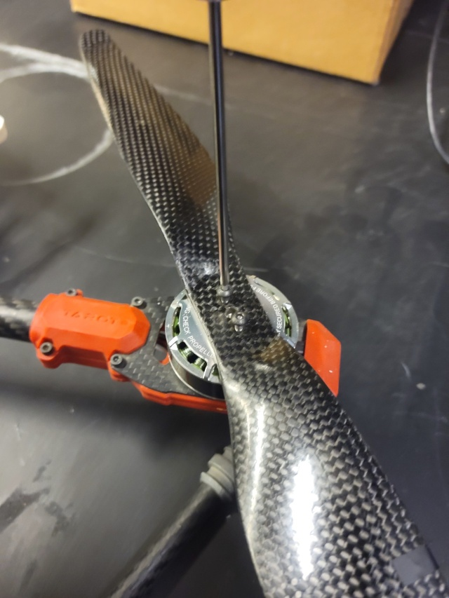

## Propeller Assembly Instructions

The GEMINI quadcopter is based on Arducopter, and the motor layout follows their QUAD X configuration.

{: style="height: 320px;"}
{: style="height: 320px;"}

Assemble the propellers by matching the motors' rotation direction with the propellers' rotation direction. The correct propeller rotation direction is the one that pushes air downwards when spinning. The correct orientation can be illustrated below when holding the propeller at eye level and looking at the blades.

{: style="height: 320px"}

Install the propellers onto the motor mounts using the included M3 screws. Tighten the screws firmly enough to prevent the propellers from detaching during flight. However, be careful not to overtighten, as this could damage the propeller and the motor threads.

{: style="height: 320px"}
{: style="height: 320px"}
{: style="height: 320px"}