## Installing Mission Planner
You can follow the instructions from [Installing Mission Planner — Mission Planner documentation](https://ardupilot.org/planner/docs/mission-planner-installation.html){:target="_blank"}

For Android Tablets, you can download and install this APK file: 

- [Release Android Development Build · ArduPilot/MissionPlanner · GitHub](https://github.com/ArduPilot/MissionPlanner/releases/tag/latest){:target="_blank"}

- [com.michaeloborne.MissionPlanner-signed.apk](https://github.com/ArduPilot/MissionPlanner/releases/download/latest/com.michaeloborne.MissionPlanner-signed.apk){:target="_blank"}

## Using a Tablet or PC?

An Android tablet will be provided with the GEMINI Drone. You can connect the drone with a datalink USB, the same as a PC. Using a tablet, you can monitor the drone status when you are out in the field. However, using a PC is recommended if you want to change detailed settings and make flight missions with keyboards and a mouse.

## How to Make Survey Missions in Mission Planner
1. Open the Mission Planner program.
    
1. Click "Plan".
    

3. The home location will be used as a starting point when you're making the flight missions. If you connect the drone, you can see where the home position is. If you can't see the maps of your field, you can manually set the home location by entering the Latitude and Longitude or clicking on the map.

- For example, the UC Davis RMI Vineyard location is: 
Latitude: 38.5323259361796
Longitude: -121.752081513405 

You can also set the default altitude for your waypoints by setting "Default Alt".

4. Draw a Polygon using the right-click menu -> Polygon -> Draw a Polygon.

5. To create a survey mission, right-click -> Auto WP -> Survey (Grid).

6. You can see the generated paths, but you have to modify the parameters. Click "Advanced Options". It will show more settings.
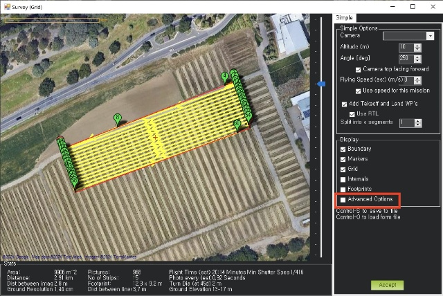

7. Select the Camera to estimate the camera's field of view. 
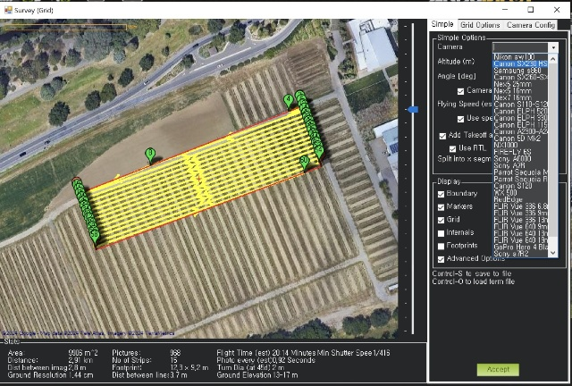
- Choose FLIR Vue 336 6.8mm because the FLIR One Pro's FOV is 50x40 and FLIR Vue 336 6.8mm is 45x35.
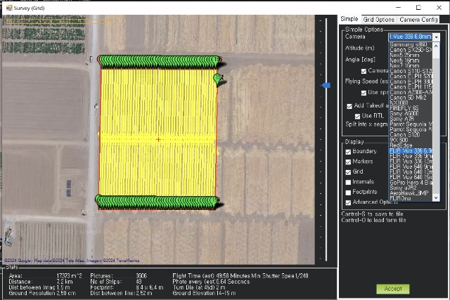
- Set the flight speed. Recommended speed: 2m/s ~ 4m/s.
- Check the total flight time and the period for Photo every.

- Optimize the Polygon by only showing the Polygons and move the points.
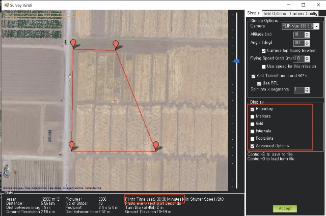

- Make sure the flight time is within the drone's max flight time (20 minutes).
- Check "Use speed for this mission", "Add Takeoff and Land WPs", and "Use RTL" if you want the drone to automatically land at the launch point after the mission.

- Click "Accept".

8. Save the polygon and waypoints to a file.
- Save polygon just in case it's needed again.
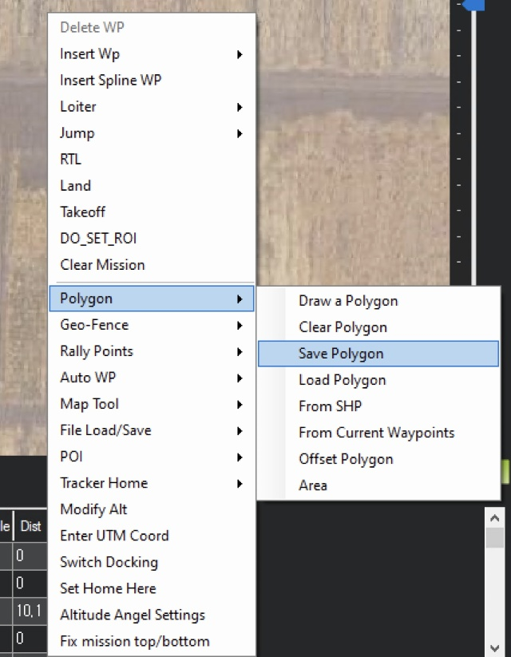
- Save the waypoint file to reload the waypoints to the program

8. Write the waypoints to the drone when it's connected to the Mission Planner Software.

## How to Prepare the Drone Flight
1. Open the box and bring out the drone.
    
    

    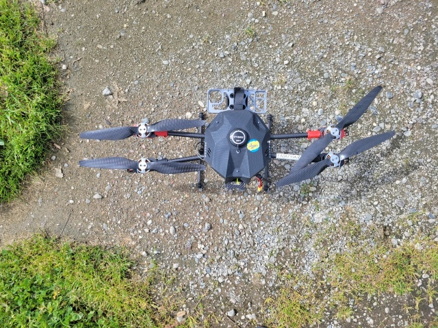

2. Mount the iPhone and FLIR One Pro to the tray.
    
3. Expand the arm until it's clicked to the arm clip.
    

4. Install the Li-Po battery and tie it.
    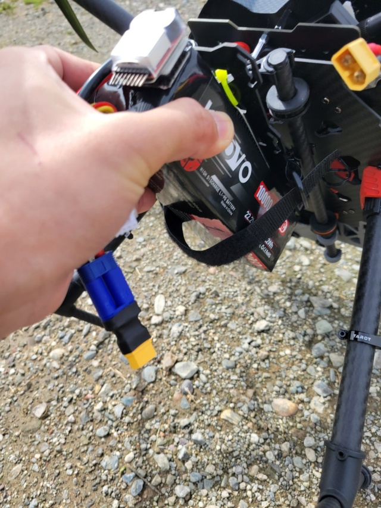
    

4. Power up the drone and plug the USB Radio module into your computer. Be aware of the plus and minus of the connector.

    

    

    

5. Open the Mission Planner Application.
    
6. Select AUTO and Click Connect. It will automatically scan the port and find the USB radio module.
    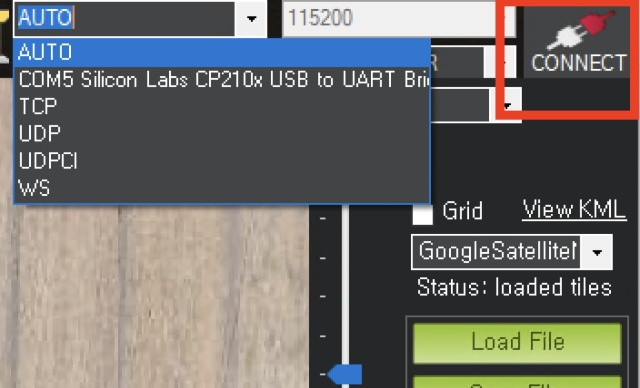
4. Now you can see the location and status of the drone.
    
7. Press the hardware safety switch to activate the drone.
    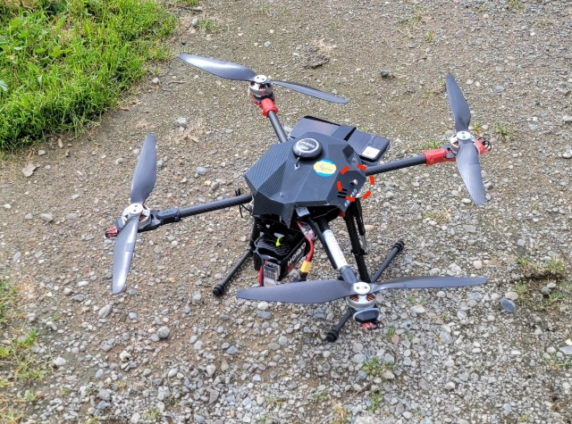
    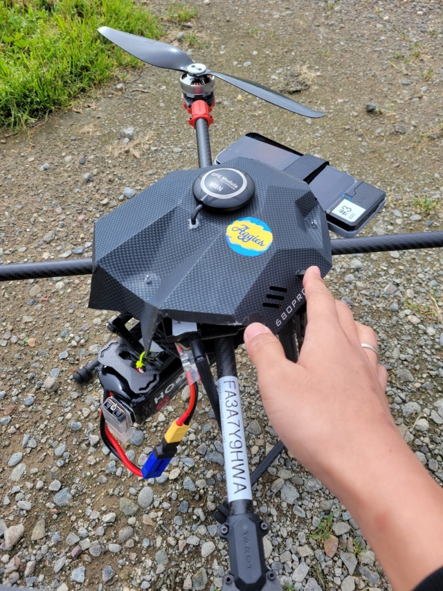

8. Arm the motors by pressing the left stick to the lower right corner and hold it.

9. Now you can fly the drone.

10.  To disarm the motors after the flight, press the left stick to the lower left corner and hold it.

## How to Start the Auto Mission
1. Follow the instructions from #How to prepare the drone flight
2. Write the waypoints to the drone when it's connected to the Mission Planner Software.

3. Press the hardware safety switch to activate the drone.

4. Arm the motors by pressing the left stick to the lower right corner and hold it.

5. Lift the Throttle to 20~30% and Toggle the Auto switch. It will automatically launch and start the mission.
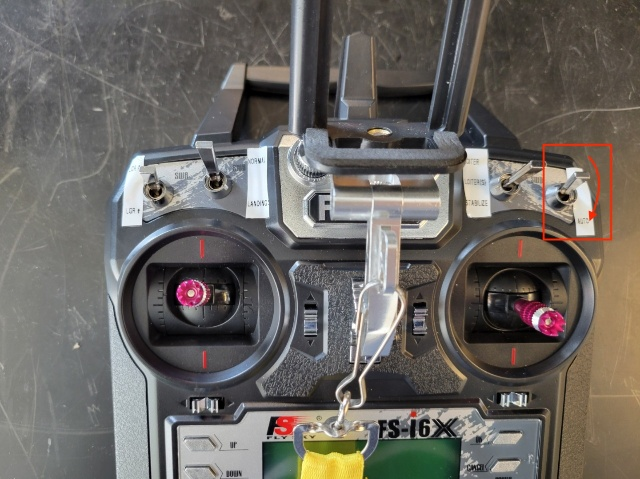

6. If you set auto landing, it will return to the launch position and automatically land. If you did not set the auto return, it will stay at the last waypoint in the Mission, and you will have to land the drone manually.

## Useful videos
[Introduction to Mission Planner - YouTube](https://www.youtube.com/watch?v=6OdcdR8hjd0&t=350s){:target="_blank"}
