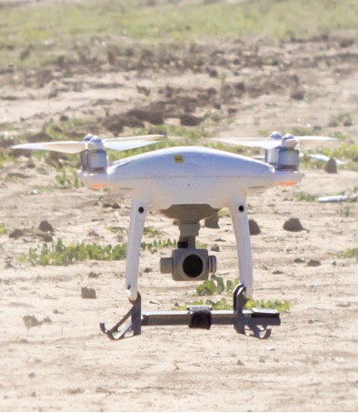
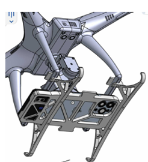
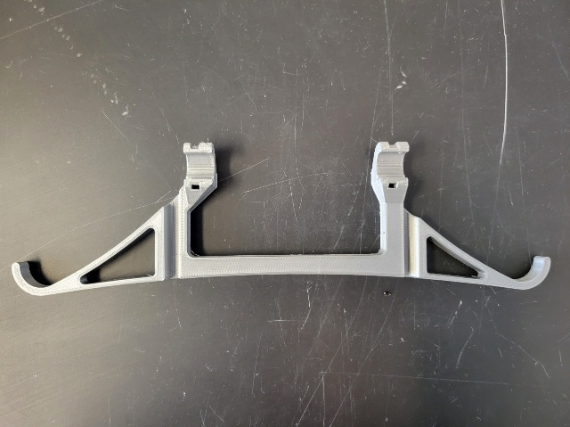
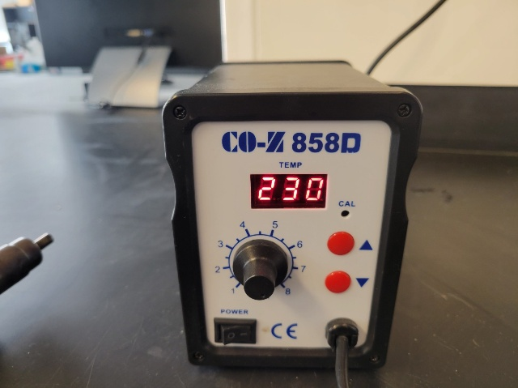
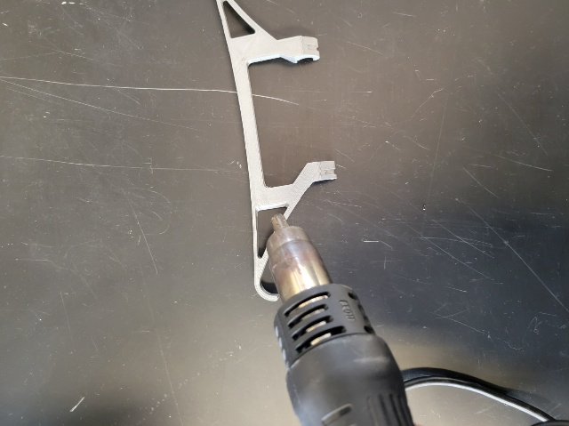
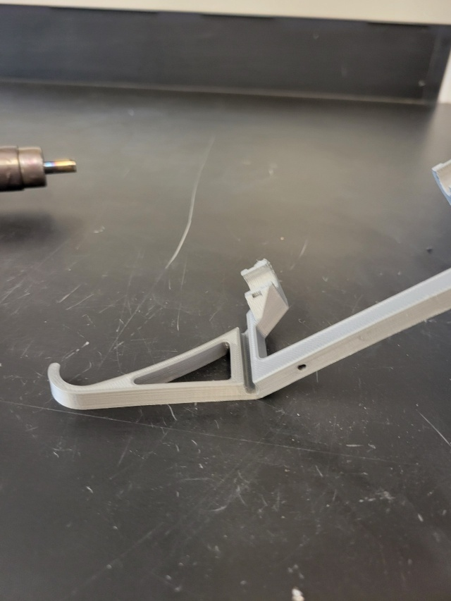
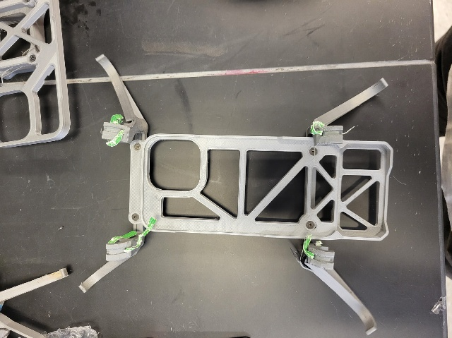

## DJI Phantom 4 for GEMINI Sensing

A 3D-printable model has been developed to mount an iPhone under the DJI Phantom 4 for remote sensing. 

Download STL files:
[Phantom4_iPhone13_Mount_Legs](attachment/Phantom4_iPhone13_Mount_Legs.stl) | 
[Phantom4_iPhone13_Mount_Tray](attachment/Phantom4_iPhone13_Mount_Tray.stl)

For printing, PETG filament is recommended over PLA due to its greater heat resistance. Follow the extruder temperature and the manufacturer's recommended temperature for the filament.
After 3D printing, use a heat gun to bend the drone legs to the desired angle. Bending the legs provides better stability during landing and prevents them from appearing in the field of view when simultaneously capturing video with the DJI gimbal camera.

For PETG, set the heat gun temperature to 230 degrees Celsius.

When bending the legs outward, the outer side is more prone to tearing due to greater length deformation. Therefore, apply heat evenly to the outer side to make the bending area pliable. However, avoid excessive heat, as this can cause damage.

After applying heat, place the leg on a flat surface and bend it. If the angle is insufficient, apply additional heat to the bending area with the heat gun to achieve the desired angle.

Assemble the bent leg parts and the tray part using M3 15mm pan head screws. Then, insert the wire that secures the assembly to the drone legs.

