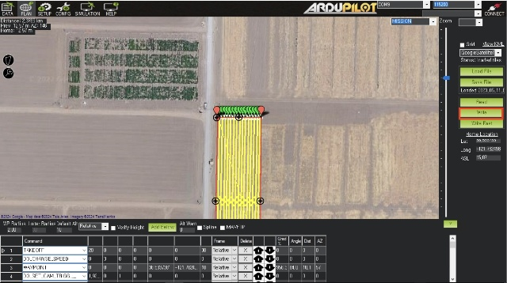
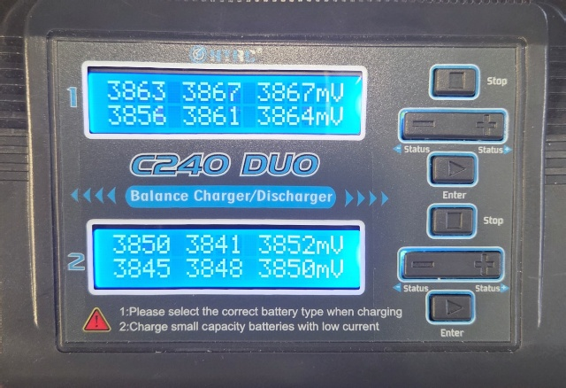
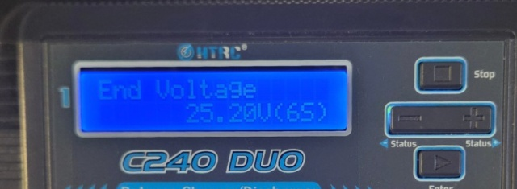
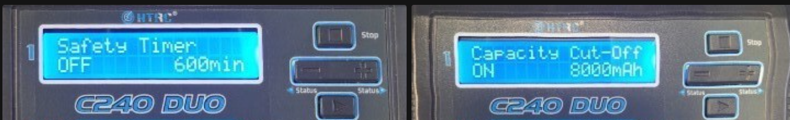

## Drone Operation Manual
### Installing Mission Planner
You can follow the instructions from [Installing Mission Planner — Mission Planner documentation](https://ardupilot.org/planner/docs/mission-planner-installation.html){:target="_blank"}

For Android Tablets, you can download and install this APK file: 

- [Release Android Development Build · ArduPilot/MissionPlanner · GitHub](https://github.com/ArduPilot/MissionPlanner/releases/tag/latest){:target="_blank"}

- [com.michaeloborne.MissionPlanner-signed.apk](https://github.com/ArduPilot/MissionPlanner/releases/download/latest/com.michaeloborne.MissionPlanner-signed.apk){:target="_blank"}

### Using a Tablet or PC?

You can connect the drone to an android tablet using USB OTG, the same as a PC. Using a tablet, you can monitor the drone's status and telemetry data when you are out in the field. However, using a laptop PC is recommended if you want to change detailed settings.

### How to Make Survey Missions in Mission Planner
1. Open the Mission Planner program.
    
1. Click "Plan".
    

3. The home location will be used as a starting point when you're making the flight missions. If you connect the drone, you can see where the home position is. If you can't see the maps of your field, you can manually set the home location by entering the Latitude and Longitude or clicking on the map.

- For example, the UC Davis RMI Vineyard location is: 
Latitude: 38.5323259361796
Longitude: -121.752081513405 

You can also set the default altitude for your waypoints by setting "Default Alt".

4. Draw a Polygon using the right-click menu -> Polygon -> Draw a Polygon.

5. To create a survey mission, right-click -> Auto WP -> Survey (Grid).

6. You can see the generated paths, but you have to modify the parameters. Click "Advanced Options". It will show more settings.

7. Select the Camera to estimate the camera's field of view. 

- Choose FLIR Vue 336 6.8mm because the FLIR One Pro's FOV is 50x40 and FLIR Vue 336 6.8mm is 45x35.

- Set the flight speed. Recommended speed: 2m/s ~ 4m/s.
- Check the total flight time and the period for Photo every.

- Optimize the Polygon by only showing the Polygons and move the points.

- Make sure the flight time is within the drone's max flight time (20 minutes).
- Check "Use speed for this mission", "Add Takeoff and Land WPs", and "Use RTL" if you want the drone to automatically land at the launch point after the mission.

- Click "Accept".

8. Save the polygon and waypoints to a file.
- Save polygon just in case it's needed again.

- Save the waypoint file to reload the waypoints to the program

8. Write the waypoints to the drone when it's connected to the Mission Planner Software.

### How to Prepare the Drone Flight
1. Open the box and bring out the drone.
    
    

    

2. Mount the iPhone and FLIR One Pro to the tray.
    
3. Expand the arm until it's clicked to the arm clip.
    

4. Install the Li-Po battery and tie it.
    
    

4. Power up the drone and plug the USB Radio module into your computer. Be aware of the plus and minus of the connector.

    

    

    

5. Open the Mission Planner Application.
    
6. Select AUTO and Click Connect. It will automatically scan the port and find the USB radio module.
    
4. Now you can see the location and status of the drone.
    
7. Press the hardware safety switch to activate the drone.
    
    

8. Arm the motors by pressing the left stick to the lower right corner and hold it.

*Note* GEMINI drone controller is MODE 2 to comply with most recent drone pilots. If you want to change the controller setting, please refer below:

[What is the difference between Mode 1 and Mode 2?](https://www.modelflight.com.au/blog/difference-between-mode-1-vs-mode-2?srsltid=AfmBOoqD12TmORQycLJ9knHdwYFnJvb8uMm98uQtcYdJ-fLbl2JrlE2u)

[Flysky FS-i6X Transmitter Mode 1 To Mode 2 Modification](https://www.youtube.com/watch?v=F79aGFrKG7U&t)

[FlySky FSi6 - MODE 1 or MODE 2 Setup](https://www.youtube.com/watch?app=desktop&v=PiR5fYBfUKg&t0)

9. Now you can fly the drone.

10.  To disarm the motors after the flight, press the left stick to the lower left corner and hold it.

### How to Start the Auto Mission
1. Follow the instructions from #How to prepare the drone flight
2. Write the waypoints to the drone when it's connected to the Mission Planner Software.

3. Press the hardware safety switch to activate the drone.

4. Arm the motors by pressing the left stick to the lower right corner and hold it. 

5. Lift the Throttle to 20~30% and Toggle the Auto switch. It will automatically launch and start the mission.

6. If you set auto landing, it will return to the launch position and automatically land. If you did not set the auto return, it will stay at the last waypoint in the Mission, and you will have to land the drone manually.

### Useful videos
[Introduction to Mission Planner - YouTube](https://www.youtube.com/watch?v=6OdcdR8hjd0&t=350s){:target="_blank"}

## How to use drone battery charger
### Introduction
This document explains how to charge a drone battery using a drone battery charger. After reading this, you will know how to charge a drone battery, how to set the battery voltage to storage mode after a flight, precautions to take when charging the battery, and how to respond in case of errors.

### Battery specs

GEMINI Custom drones come with 7000 ~ 10000 mAh Lithium polymer batteries.
The maximum possible flight time varies depending on the battery capacity and the drone’s payload, but generally, about 25 minutes of flight is possible.

### Charger specs
For this project, we use a charger capable of balance charging lithium polymer batteries. Balance charging means equalizing the voltage of each cell when multiple cells, such as in a 6S Lipo battery, are connected. The battery connector used is an XT60 connector.

### Setting up charger
Open the box and find the cables. The first cable is a banana plug to XT60 plug converter. Connect the two banana cables to the charger, paying attention to the red (+) and black (-) colors.

Next, connect the balance port extension board. Connect the balance board extension cable from the box to the charger main unit, and then connect the cable to the extension board.

Plug the charger’s main power cable into a wall outlet and turn on the power switch on the back of the main unit.

### Charger setting
The charger consists of two independently operating units in one main body; Unit 1 controls the left port, and Unit 2 controls the right port.

When you first start the charger, the PROGRAM SELECT screen will appear. Use the (+) and (-) buttons to select the Lithium BATT screen, then press the ▶️ button to select it. The LiPo Balance CHG screen will then appear.

Next, connect the battery. After connecting the battery, check that the voltage setting is at 22.2V (6S). If the voltage setting is incorrectly set to 18.5 (5S) or similar, press the ▶️ button to make it blink, then set it to 22.2V (6S).

Next, press and hold the ▶️ button to start charging. The charger will check if the connected battery’s voltage matches the charging specs, and if not, an error will appear.

If everything is normal, press the ▶️ button once more to start charging. Wait about 2 hours for a full charge.

While charging, you can press the (+) button to check the voltage of each cell. If the voltage of a particular cell is too low or too high, it is likely that there is a problem with the battery, so it is recommended to stop charging the battery.

By pressing the (–) button, you can view the charging parameters. Here, you can check whether the final voltage is set appropriately, as well as how the charge capacity cut-off and charge time cut-off are configured. If you wish to change these settings, please refer to the manufacturer's user manual.

### Battery storage mode

Lithium polymer batteries used in drones should not be stored for more than a week in a fully discharged or fully charged state, as this can shorten battery lifespan and cause malfunctions. Therefore, when storing drone batteries for an extended period without use, it is recommended to charge or discharge each cell to the storage voltage of 3.8V. On the charger, press the ▶️ button to make the charger mode setting blink, then press the (-) or (+) button to switch from Balance CHG to Storage mode. Next, press and hold the ▶️ button to enter Storage mode.

