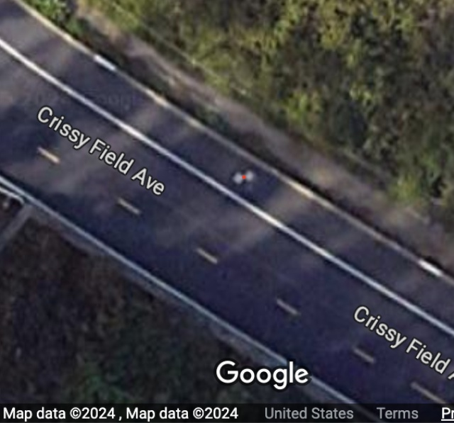
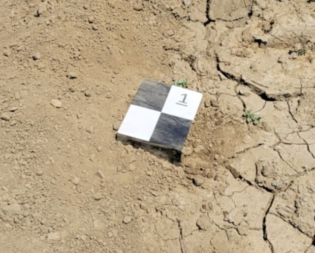

## Introduction to Ground Control Points (GCPs)
- **Definition and purpose of GCPs:**  
    Ground Control Points (GCPs) are points on the ground with known latitude, longitude, and altitude used to georeference remote sensing images. This involves placing markers on the ground and measuring their positions using GPS or other methods. The size of the GCPs can vary depending on the resolution of the remote-sensing imagery.
    
- **Importance of GCPs in drone surveying and mapping:**  
    GCPs' positional accuracy affects the positional accuracy of remote sensing images. They also provide ground truth key points for drone image processing.

    For more information, refer to;

    [Ground control points: why are they important? | Pix4D](https://www.pix4d.com/blog/why-ground-control-points-important/)
    
    [How Do I Use Ground Control Points?](https://www.dronedeploy.com/blog/what-are-ground-control-points-gcps)

### Types of Ground Control Points
- **Common types of GCPs used in drone remote sensing:**  
    Remote sensing often utilizes identifiable fixed objects with known latitude and longitude values obtainable from sources like Google Maps or other satellite images. However, agricultural fields sometimes need dedicated GCPs due to the need for identifiable and stationary objects. In drone remote sensing, GCPs (Ground Control Points) are either installed in the field as portable tarp-like GCPs for each drone flight or they are left in place throughout the remote sensing project. GCPs are typically designed as checkerboard patterns for easy identification in digital images and are placed in the field.

- **Examples of GCPs**
	Example of GCP near [Golden Gate Bridge](https://maps.app.goo.gl/xdGt7uN5pihy5JEr5)
	

	Example of a GCP plate in the field
	

### Setting Up Ground Control Points
- GCPs for Low Altitude Drone Remote Sensing
For low-altitude, high-resolution drone remote sensing, GCPs (Ground Control Points) the size of a Letter or A4 paper are sufficient for identification. For example, when acquiring imagery at an altitude of 10 meters using a DJI Phantom 4, a resolution of 0.27cm/pixel can be achieved. This means a GCP made with Letter-size paper would appear approximately 80x100 pixels. 

- Example GCP file used in GEMINI Project
The GCPs are designed with a checkered pattern for easy identification in aerial imagery. To prevent confusion when numbers are flipped (e.g., 6 and 9), an underline has been added to each number. PDF files for GCPs numbered 1 through 16 are attached, along with Microsoft PowerPoint format files. 
[Download GCP PDF](attachment/3ce7803b44919958dea5e00e42e1b5e6.pdf) | 
[Download GCP PowerPoint](attachment/1a0379bc91063dcefd18f747cd8a3472.pptx)

### GCP location selection criteria
- Total Number of GCPs  
    For a typical drone remote sensing project, it is advisable to have 5 to 10 GCPs (Ground Control Points) evenly distributed across the field to be surveyed.
    
- Choosing optimal locations (e.g., corners of buildings)  
    When utilizing existing terrain features as GCPs, it is recommended to select points where the color of the terrain changes or corners as GCPs.
    
- Avoiding obstructions and shadows  
    If there are objects taller than the GCPs in the vicinity, shadows may be cast on the GCPs or they may be obscured in images depending on the relative positions of the drone and the GCPs. Therefore, such locations should be avoided, or obstacles should be removed.
### References
[Ground control points: why are they important? | Pix4D](https://www.pix4d.com/blog/why-ground-control-points-important/)  
[How Do I Use Ground Control Points?](https://www.dronedeploy.com/blog/what-are-ground-control-points-gcps)  
[A Comprehensive Guide to Using Ground Control Points for Drone Surveying - JOUAV](https://www.jouav.com/blog/ground-control-points.html)  
[Ground Control Points | DJI Enterprise](https://enterprise-insights.dji.com/blog/ground-control-points)

---

## Measuring GCPs