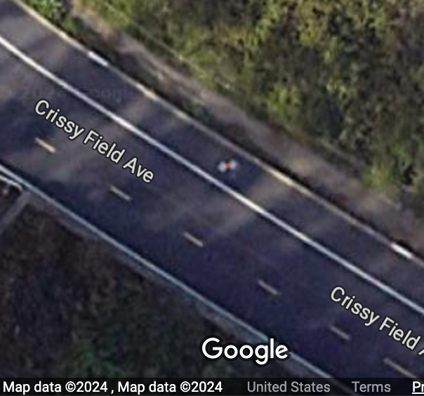
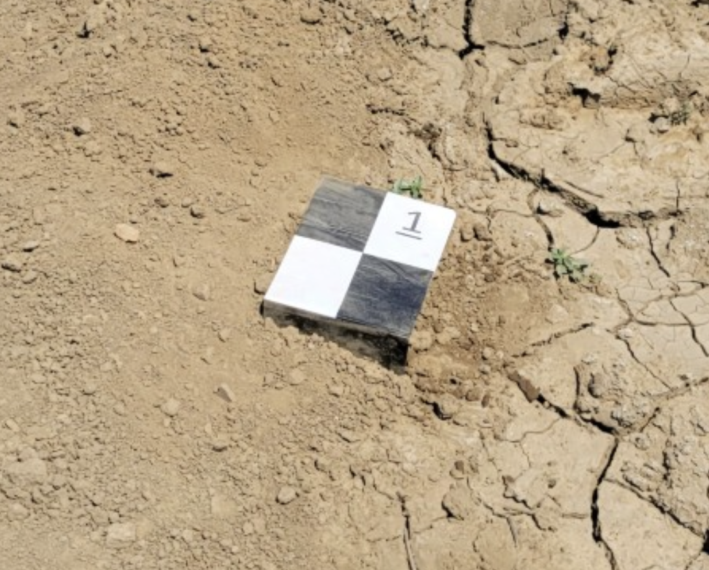

---

title: Ground Control Points (GCPs)

---
## Ground Control Points (GCPs)

### Introduction to Ground Control Points (GCPs)

- **Definition and purpose of GCPs:**  
    Ground Control Points (GCPs) are points on the ground with known latitude, longitude, and elevation used to georeference remote sensing images. This involves placing markers on the ground and measuring their positions using GPS or other methods. The size of the GCPs varies depending on the resolution of the remote-sensing imagery.
    
- **Importance of GCPs in drone surveying and mapping:**  
    The positional accuracy of GCPs directly affects the absolute positional accuracy of remote sensing images. They also provide accurate keypoints for drone processing, aiding in point cloud generation and orthomosaic processing.
    
- **Overview of remote sensing applications:**  
    GCPs enable the mapping of remote sensing images that lack inherent geographic information. Even when images have existing location data, GCPs can enhance their positional accuracy. Using the same GCPs across multiple temporal remote sensing images improves the relative positional accuracy between them.
    

For more information, refer to:

- [Ground control points: why are they important? | Pix4D](https://www.pix4d.com/blog/why-ground-control-points-important/)
- [How Do I Use Ground Control Points?](https://www.dronedeploy.com/blog/what-are-ground-control-points-gcps)

### Types of Ground Control Points

- **Common types of GCPs used in drone mapping:**  
    Urban remote sensing often utilizes identifiable fixed objects with latitude and longitude values obtainable from sources like Google Maps. However, agricultural fields require separate GCP installation during the growing season due to frequent changes in cultivation patterns visible in satellite imagery.
    
- **Characteristics of effective GCPs:**  
    GCPs are typically designed as checkerboard patterns for easy identification in digital images and are placed in the field.
    
- **Examples of GCP setups:**

Example of GCP near Golden Gate Bridge [maps.app.goo.gl/xdGt7uN5pihy5JEr5](https://maps.app.goo.gl/xdGt7uN5pihy5JEr5)

Example of small GCP plate in the field
### Setting Up Ground Control Points

- **Site selection criteria:**
    
    - Field of view considerations
    - Avoiding obstructions and shadows
    - Choosing optimal locations (e.g., corners of buildings)
- **Marking and recording accurate coordinates:**
    
- **Equipment requirements for establishing GCPs:**
    

### Measuring GCPs

- **Importance of precision in GCP measurement:**  
    GCP accuracy influences how well the image aligns with other data sources when comparing it to yield maps or soil maps. Inaccurate GCP information can lead to geometric distortions in orthomosaics. Inconsistent GCP accuracy across multiple data collection sessions can cause misalignment in multi-temporal remote sensing.
    
- **Methods for measuring the positions of GCPs:**  
    GPS can measure the positions of permanently fixed or temporarily installed GCPs. The most commonly used coordinate system is WGS84, which measures latitude, longitude, and altitude. These coordinates can be converted to UTM if needed.
    
- **Real-Time Kinematic (RTK) GPS:**  
    RTK GPS is preferred for its ability to measure GCP positions with centimeter-level accuracy. However, it has drawbacks, such as high equipment cost and limited accessibility. Smartphone GPS can be used for GCP positioning when only analyzing relative positional accuracy in multi-temporal imagery.
    
- **Measuring GCPs using SW Maps:**  
    SW Maps is a free GIS software available on smartphones. [SW Maps](https://aviyaantech.com/swmaps/)  
    Apple: [SW Maps on the App Store](https://apps.apple.com/us/app/sw-maps/id6444248083)  
    Android: [SW Maps - GIS & Data Collector - Apps on Google Play](https://play.google.com/store/apps/details?id=np.com.softwel.swmaps&hl=en_US)
    
- **Tips for maintaining accuracy during measurement sessions:**  
    (Please provide the missing information for this section)
    

### Enhancing Accuracy with GCPs

- **Concept of absolute and relative accuracy:**
- **Importance of multiple GCPs for distance and scale establishment:**
- **Relationship between GCPs and ground sample distance (GSD):**

### Best Practices for GCP Placement

- **Recommended distances and overlaps between GCPs:**
- **Consideration of terrain and slope:**
- **Preventing damage to GCPs in dynamic environments:**

### Data Collection and Processing

- **Techniques for capturing GCPs with drones:**
- **Post-processing data to improve map accuracy:**
- **Common software tools used for processing GCP data:**

### Case Studies and Applications

- **Examples of successful GCP implementation in drone surveys:**
- **Lessons learned from various industries (e.g., construction, agriculture, environmental monitoring):**

### Additional Considerations

- **Troubleshooting common issues with GCP data:**
- **The future of GCPs in drone technology and remote sensing:**
- **Resources for further learning and development:**

### Conclusion

- **Summary of key points:**
- **Encouragement for best practices in GCP use for effective drone surveying:**

#### References

[Ground control points: why are they important? | Pix4D](https://www.pix4d.com/blog/why-ground-control-points-important/)  
[How Do I Use Ground Control Points?](https://www.dronedeploy.com/blog/what-are-ground-control-points-gcps)  
[A Comprehensive Guide to Using Ground Control Points for Drone Surveying - JOUAV](https://www.jouav.com/blog/ground-control-points.html)  
[Ground Control Points | DJI Enterprise](https://enterprise-insights.dji.com/blog/ground-control-points)