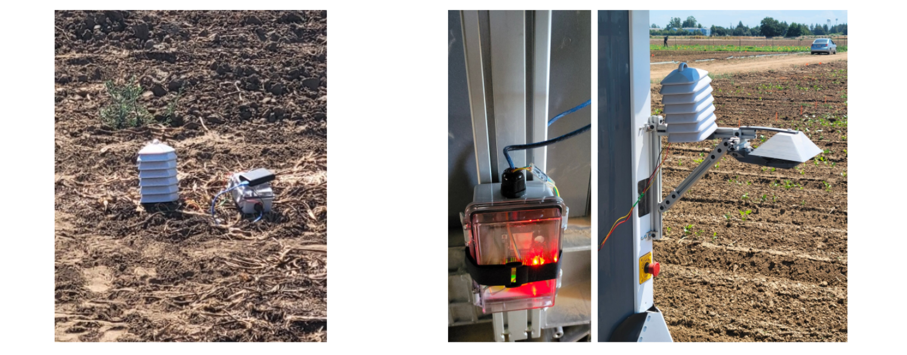
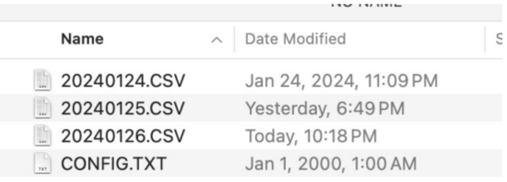

## **GEMINI Weather Station Usage**
  
### Uploading RH_Temp_Logger
- The file [RH_Temp_Logger.ino](https://github.com/GEMINI-Breeding/weather-station/blob/main/RH_Temp_Logger/RH_Temp_Logger.ino){:target="_blank"} is used to operate the weather station and must be uploaded to the Arduino before use.
- Install the [Arduino IDE](https://www.arduino.cc/en/software){:target="_blank"} software and open RH_Temp_Logger.ino in the IDE.  
- In the built-in library manager, search for and install: **SD**, **RTClib**, **DHT sensor library**, **MAX6675 library**, and **MAX6675 with hardware SPI**.  
- Connect the Arduino's USB cable to the computer and select the correct board / port in the IDE.
- Click "Upload" (Ctrl+U) to upload the sketch to the Arduino. The station is now ready for use with the GEMINI sensing app.
- To verify everything is working properly, the serial monitor in the Arduino IDE can be used.

**Expected Output**

### General Usage
- Connect the USB cable from the Arduino to a 5V power supply.  
- To update the weather station's RTC clock (GMT-0 time zone), turn on the GEMINI app prior to powering the weather station. 
- Depending on your use case, you may either place the weather station in the field to take measurements or attach the unit to the rover.   

- Data from the weather station is stored in the SD Card on the datalogger. The data is logged in a CSV format in a file titled YYYYMMDD.CSV based on the current date. 
