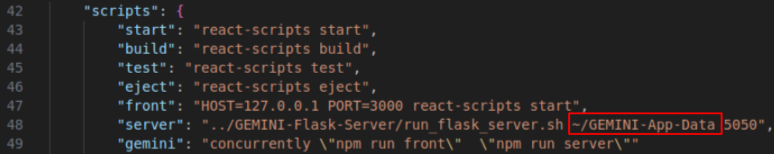

## **Windows**

- [Install WSL2](https://learn.microsoft.com/en-us/windows/wsl/install){:target="_blank"} before proceeding. Install the default Ubuntu distribution to avoid compatibility issues.
- Access the WSL terminal by searching for and opening the Ubuntu application in the Windows start menu. Open a VSCode window from WSL by entering `code .` in the terminal.
- Follow the [general installation and setup instructions](#install).
- Install [Docker Desktop](https://docs.docker.com/desktop/install/windows-install/){:target="_blank"}. 
- Follow the instructions for [Configuring WSL2 with Docker Desktop](https://docs.docker.com/desktop/wsl/){:target="_blank"}. In the VSCode terminal, add your user to the docker group by entering `sudo usermod -aG docker $USER`. Use `newgrp docker` to force the change to take effect. Ensure the correct docker context is in use with `docker context use default`.
- In the VSCode terminal, enter `sudo apt-get update && sudo apt-get install libgl1` to resolve dependency issues with the libgl1 library on WSL2.

## **MacOS**

- Follow the [general installation and setup instructions](#install).
- Install [Docker Desktop](https://docs.docker.com/desktop/install/mac-install/){:target="_blank"}.
- **Note**: The GEMINI App attempts to find an NVIDIA GPU to use with OpenDroneMap for orthomosaic generation. Due to the lack of a compatibile GPU on MacOS systems, the following error is expected:
```
docker: Error response from daemon: could not select device driver "" with capabilities: [[gpu]].
```

## **Linux**

- The recommended distro for the GEMINI App is Ubuntu. Other distros may encounter compatibility issues that will require further debugging.
- Follow the [general installation and setup instructions](#install).
- Install [Docker Desktop](https://www.docker.com/products/docker-desktop/){:target="_blank"} based on the instructions for your system. 
- If your system has an NVIDIA GPU that should be used for orthophoto generation, install the [NVIDIA Container Toolkit](https://docs.nvidia.com/datacenter/cloud-native/container-toolkit/latest/install-guide.html){:target="_blank"} and follow the relevant setup instructions.
- In a terminal, enter `docker context use default` to use the Docker Engine instead of Docker Desktop for the GEMINI App Docker container.
- If your system does not have a compatible NVIDIA GPU or the NVIDIA Container Toolkit is not installed and configured, the following error will be seen during orthophoto generation:
```
docker: Error response from daemon: could not select device driver "" with capabilities: [[gpu]].
```
- This error will lead to the CPU being used for orthophoto generation, which may result in longer generation time.

## Install
- Access the [GEMINI-App repository](https://github.com/GEMINI-Breeding/GEMINI-App){:target="_blank"}. 
- Clone into an IDE such as VSCode (recommended) using HTTPS or SSH. If using HTTPS, ensure your git credentials are populated via the terminal. If using SSH, make sure an [SSH key](https://docs.github.com/en/authentication/connecting-to-github-with-ssh/adding-a-new-ssh-key-to-your-github-account){:target="_blank"} for your machine is available in your Github account.
- Input the commands for setup listed on the GEMINI-App README.md:
```
# Download git submodules
git submodule update --init --recursive

# Install conda virtual environment
cd GEMINI-Flask-Server
./install_flask_server.sh
cd ../

# Install Node Version Manager
curl -o- https://raw.githubusercontent.com/nvm-sh/nvm/v0.39.5/install.sh | bash
source ~/.bashrc

# Install Node 18
nvm install 18
nvm use 18

# Install dependencies
cd gemini-app
npm install --legacy-peer-deps # Fix the upstream dependency conflict
```

## Setup
- Create a directory `GEMINI-App-Data` in your home directory (`mkdir ~/GEMINI-App-Data`).
    - If this directory is created anywhere else, the path listed in `GEMINI-App/gemini-app/package.json` must be modified:



- This path must point to a `GEMINI-App-Data` directory for the app to function.
- Create and add your [Map Box Access Token](https://docs.mapbox.com/help/glossary/access-token/){:target="_blank"} to the `.env` file in the `gemini-app` directory like below. This is necessary for map functionality. 
```
REACT_APP_MAPBOX_TOKEN=example.yourMapBoxAccessToken.1234
```

## Running the App
- Finish the system-specific setup instructions above before proceeding: [Windows](#windows) | [MacOS](#macos) | [Linux](#linux)
- Ensure Docker Desktop is running before running the GEMINI App (or Docker Engine if running ODM with GPU on Linux).

*In `GEMINI-App/gemini-app`:*

```
# Run development server (front and server concurrently)
npm run gemini 

# If you want to run front only 
npm run front

# If you want to run flask server only
npm run server
```

## Troubleshooting
- If the path in `package.json` is not properly populated, a `Failed to upload file` error will appear. Make sure the path points to an existing and accessible directory. This error will also be seen if the Flask Server fails to start.
- To ensure that the app is properly running in Docker, after the command `npm start gemini`, ensure that the terminal is NOT cleared (meaning you should be able to scroll up and see previous commands). If the terminal is cleared (you are unable to scroll up to view previous commands), the app is not running in Docker properly. Restart Docker and try again. 
- Certain errors during orthophoto generation can be solved by manual deletion of the `~/GEMINI-App-Data/temp` directory. If generation is repeatedly failing, delete `temp` before the next attempt.