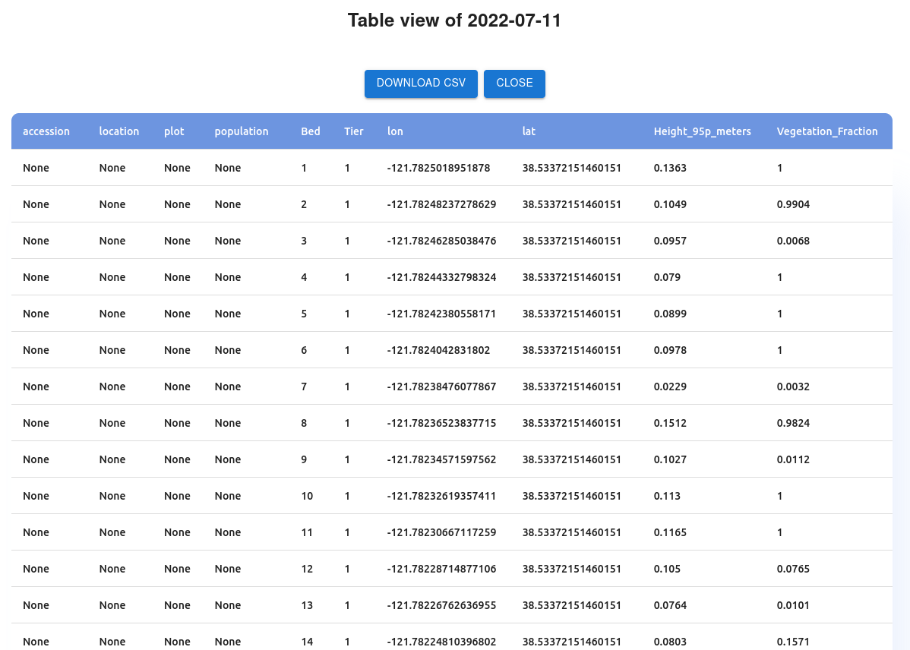

To navigate to the statistics page, click on the `Stats` Icon. Use the icon with three lines to open and close the data selection menu.

- The stats page shows processed data in tabular and graphical formats.
- To see statistics from a given date, expand the dropdown menu of the proper platform and sensor type. 
- Click `Load` on data you would like to examine. 
- For the tabular format, you will see a window showing the table of traits. If desired, `Download CSV` can be clicked for the table as a CSV file.

