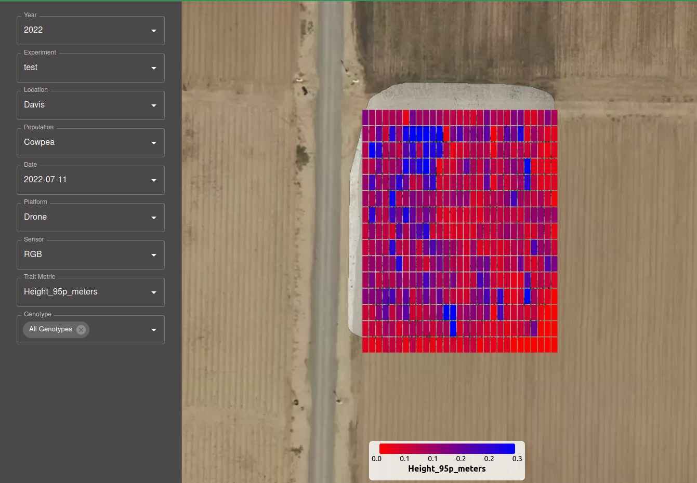
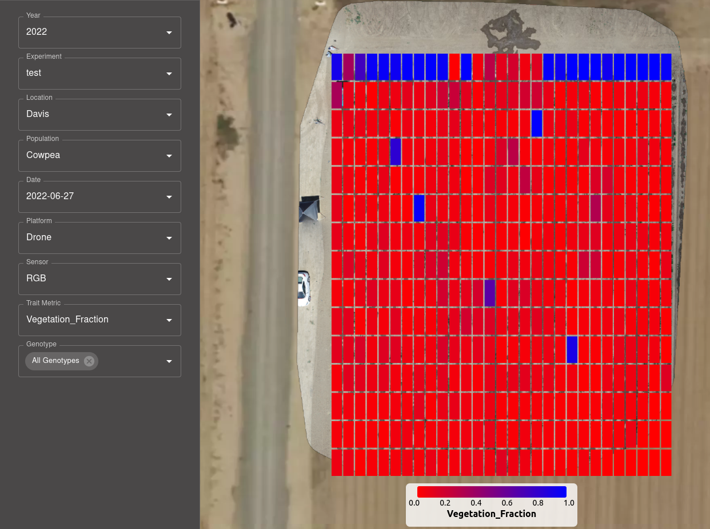

To navigate to the map page, click on the `Map` Icon. Use the icon with three lines to open and close the data selection menu.

- Populate the data selection menu with the `Year`, `Experiment`, `Location`, `Population`, `Date`, `Platform`, and `Sensor` you wish to view.
- The map will automatically adjust to show the full orthomosaic generated for the parameters selected. 
- Use the dropdown menu to select the `Trait Metric` to view. After selecting, use the next dropdown menu to select the `Genotype` to view.
- The rectangles formed in the population boundary step will show a range of colors based on the trait selected. Use the key at the bottom of the map to interpret the colors shown.

