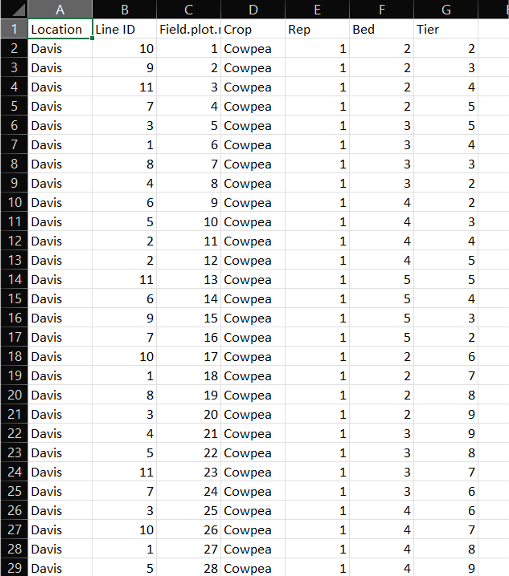
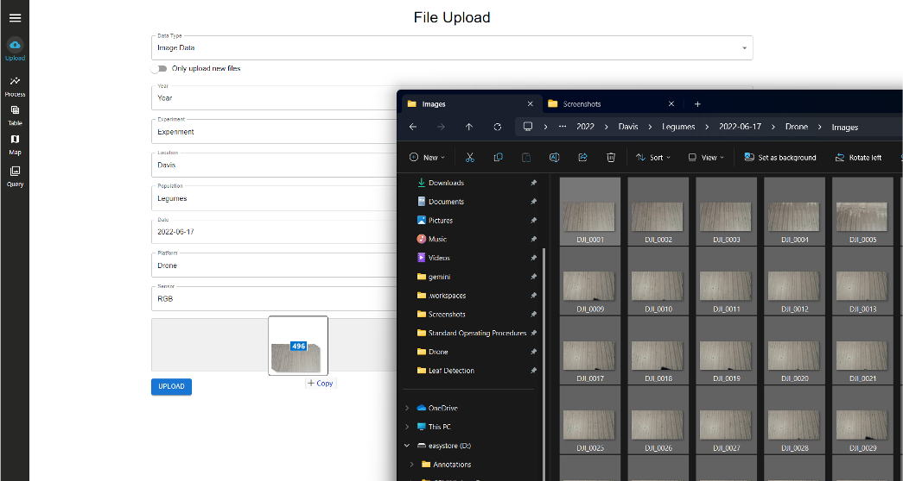

To navigate to the file upload page, click on the `Upload` Icon.

## Data Types

**Image Data**: This is the raw image files taken from the sensing platforms. These group of images should be coming from an individual sensor. Some image types include: `jpg`, `jpeg`, `png` or `tif`

**Field Design**: This is a `csv` file containing field these properties

- *Year (optional)*: The year of the experiment. If not provided, the current year will be used.
- *Plot*: The unique plot number associated with each plant.
- *Accession*: the unique accession number associated with each plant.
- *Location*: The location of the experiment.
- *Population*: The population from which the plants were selected.
- *Row*: The row number of the plot.
- *Column*: The column number of the plot.

**GCP Locations**: This is a `csv` file containing locations of GCPs. The first column should contain the label, the second column contains latitude and the third column contains longitude.

**Binary File**: This is the `.bin` that is outputted from Farm-ng's Amiga platform. This file contains the raw data from the sensors.

| Example Field Design | Example GCP Locations |
|---|---|
|  |  |

## Data Fields
s
**Year**: This is the year `YYYY` the data was collected. It is a required field. For example `2022` is a valid year.
**Experiment**: This is open for the user to decide. This will differentiate experiments for a single year. For example `Experiment 1` is a valid experiment.
**Location**: This is the location where the data was collected. For example `Davis` is a valid location.
**Population**: This is the type of plants you will be analyzing. For example `Legumes` is a valid population.
**Date**: This is the date `YYYY-MM-DD` the data was collected. It is a required field. For example `2022-06-20` is a valid date.
**Platform**: This is the sensing platform used to collect the data. For example `Drone` is a valid platform.
**Sensor**: This is the data type collected. For example `RGB` or `Theramal`is a valid sensor.

## Upload Data
   
1. Choose the `Data Type` you want to upload.
2. Fill in the respective fields.
3. Drag and drop your files in the upload region.
 
    

## Video Deomnstration
