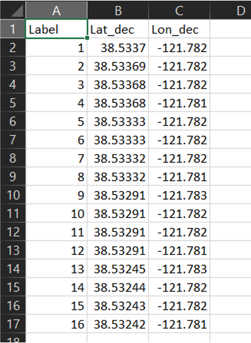

## File Upload Page
To navigate to the file upload page, click on the `Upload` Icon.

## Data Types

* **Image Data**: This is the raw image files taken from the sensing platforms. These group of images should be coming from an individual sensor. Some image types include: `jpg`, `jpeg`, `png` or `tif`
  
* **Field Design**: This is a `csv` file containing field properties such as plot numbers, bed, tiers and crop types.Here is an example:
  
    

        
    

        
* **GCP Locations**: This is a `csv` file containing locations of GCPs. The first column should contain the label, the second column contains latitude and the third column contains longitude. Here is an example:
  
    

        
    

* **Binary File**: This is the `.bin` that is outputted from Farm-ng's Amiga platform. This file contains the raw data from the sensors.

## Data Fields

* **Year**: This is the year `YYYY` the data was collected. It is a required field. For example `2022` is a valid year.
* **Experiment**: This is open for the user to decide. This will differentiate experiments for a single year. For example `Experiment 1` is a valid experiment.
* **Location**: This is the location where the data was collected. For example `Davis` is a valid location.
* **Population**: This is the type of plants you will be analyzing. For example `Legumes` is a valid population.
* **Date**: This is the date `YYYY-MM-DD` the data was collected. It is a required field. For example `2022-06-20` is a valid date.
* **Platform**: This is the sensing platform used to collect the data. For example `Drone` is a valid platform.
* **Sensor**: This is the data type collected. For example `RGB` or `Theramal`is a valid sensor.

## Upload Data
   
   1. Choose the `Data Type` you want to upload.
   2. Fill in the respective fields.
   3. Drag and drop your files in the upload region.

        

            
        
