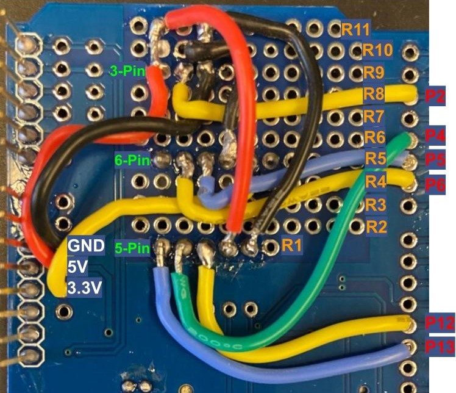

## Component List
- **Arduino Uno R3 (or equivalent)**: [Documentation](https://docs.arduino.cc/hardware/uno-rev3/){:target="_blank"}
- **Datalogger Shield**: [Documentation](https://learn.adafruit.com/adafruit-data-logger-shield/overview){:target="_blank"}
- **DHT22 Temperature / Humidity Sensor**: [Documentation](https://www.sparkfun.com/datasheets/Sensors/Temperature/DHT22.pdf){:target="_blank"}
- **HM-10 Bluetooth Module**: [Documentation](https://people.ece.cornell.edu/land/courses/ece4760/PIC32/uart/HM10/DSD%20TECH%20HM-10%20datasheet.pdf){:target="_blank"}
- **MAX6675 Thermocouple-to-Digital Converter**: [Documentation](https://www.analog.com/media/en/technical-documentation/data-sheets/max6675.pdf){:target="_blank"}
- **Enclosure**: [Link](https://www.amazon.com/Laisomeke-Waterproof-Junction-Enclosure-Electrical/dp/B0BR5DY1VG?th=1){:target="_blank"}
- SD Card for storing collected data
- Basic soldering and crimping equipment

## Build Instructions

**Setup**

- Bore a hole in the side of the box to size for a cable gland. Insert a cable gland into the hole. 
- Secure the Arduino and the bluetooth module in the bottom inside of the enclosure. Secure the thermocouple module to the inside side of the box opposite the hinge with its pins facing away from the cable gland.
- Attach the temperature / humidity sensor to the top of the enclosure if using a radiation shield. If not, attach the sensor on the side of the enclosure.

**Arduino Wiring Guide**

- On three distinct, well-spaced rows of the prototyping area of the datalogger, solder 5-pin, 6-pin, and 3-pin male [JST-XH headers](https://www.amazon.com/GeeBat-460pcs-Connector-Housing-Adapter/dp/B01MCZE2HM){:target="_blank"}. Leave the bottom two rows of the prototyping area untouched. The image below uses rows R1, R5, and R9, leaving R11 free for later.

- Begin soldering. Solder a wire from the 5V source to R11 for easier access to the source later on. Solder a wire from the board GND to another point on R11. 
(insert an image here after this step)

- **NOTE: All pins referred to for soldering on the board reference the digital pins on the right side, not the analog inputs on the bottom left.**

- ***5-pin header***: Connect the first (leftmost) pin (as shown below) to P13. Connect the next pin to P4. Connect the third pin to P12. Connect the fourth pin to the 5V source. Connect the final pin to GND.
(insert an image here after this step)
- ***6-pin header***: The outer pin on either side will be unused. Connect the second pin (leftmost pin in use) to P6. Connect the third pin to P5. Connect the fourth pin to GND. Connect the fifth pin (rightmost pin in use) to the 3.3V source. (insert an image here after this step)
- ***3-pin header***: Connect the first (leftmost) pin to the 5V source. Connect the second pin to P2. Connect the third (rightmost) pin to GND. (Insert image after this step)
- The final soldered board should look similar to this:

- With three distinctly colored wires, use female JST-XH crimp terminals and a crimp tool to crimp the ends of each wire. Connect the ends of each wire to 3-pin female JST-XH Headers. Repeat this process for five wires. 
- Using **four** distinctly colored wires, connect the ends of each wire to the **middle four** pins of **6-pin** female JST-XH headers.
- Connect the female wire headers to the properly sized male headers on the board. The 6-pin connector should be connected to the bluetooth module, with the 5-pin and 3-pin connectors going to the thermocouple module and the cable gland respectively.
- To ensure that the wires are connected properly, one can match the pin connected to the voltage source with the VCC or GND pin on the respective component. Pay attention to which wire is connected to each pin. 

- Three additional wires will be attached to the female JST-XH header in the cable gland to connect to the temperature / humidity sensor. Be careful to match the + (VCC) and - (GND) on the module to the soldering. 
- Connect the Arduino USB cable through the enclosure. Attach the radiation shield. Attach the thermocouple wire to the module's input, routed again through the cable gland. Attach the datalogger (with a CR1220 battery and SD Card in place) to the Arduino. 

