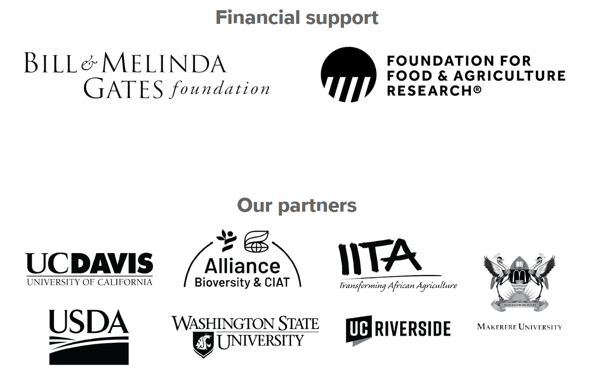

#
<figure markdown="span">
  
  <figcaption><b>G×E×M Innovation in Intelligence for Climate Adaptation</b></figcaption>
</figure>
**Our Mission**

Many staple crops that are important for food, nutritional, and economic security in low and middle-income countries have not experienced the same large gains in yield and quality over last decades as crops such as maize and soybean. Further, these crops are faced with increasing risk and uncertain growing conditions due to climate change. This project aims to develop a state-of-the-art breeding toolkit, building on the latest techniques in AI-enabled sensing, 3-D crop modeling, and molecular breeding, to create an inflection point in the productivity and quality curves of crops that are central in LMICs.

The sensing team is led by Dr. Mason Earles and will focus on using artificial intelligence and machine learning to speed up the phenotyping process in new crop varieties. While using cameras and sensors to select or measure desirable traits is nothing new in agriculture, the use of AI-enabled sensors will cut down on the time and cost of labor, which will help accelerate the development of stress-resistant, nutritious staple crops.

To accomplish this goal of accelerating crop development, the team is implementing a variety of sensing modalities for data collection, such as color, infrared, and thermal imagery as well as LiDAR scanning from both ground-based and UAV-mounted sensors. Additionally, both high quality as well as affordable sensors are being deployed with the goal of extracting the most information possible from sensors which can be deployed with minimal cost.
With this data, along with the ground truth data collected by the Pre-breeding & Genomics team, our goal is to validate AI-based models for measurement of breeding traits such as stand count, plant height, and flowering time, as well as to develop models for traits which would otherwise require extensive labor to collect across an entire field, such as leaf geometry, flower count, and yield estimation at regular intervals throughout the growing season. While rapid collection of phenotypic data across a breeding population will accelerate the development of improved crop varieties on its own, this high-resolution trait data will also inform the generation of high-quality 3D models by the 3D Modeling team. These 3D models can be used to increase the quality of AI-based models, further improving the quality of phenotyping data without the need for laborious ground truth data collection by small-scale producers and breeders.

